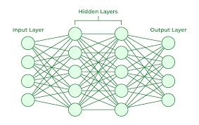
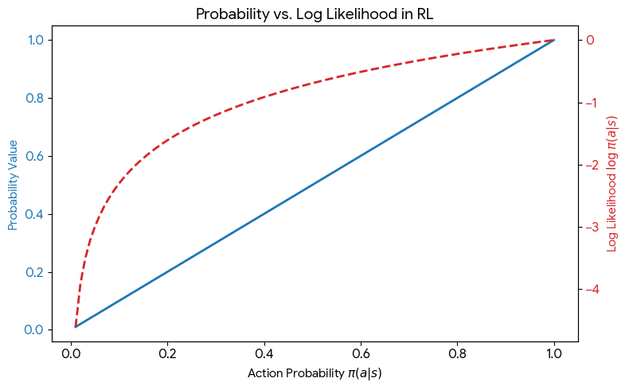

# Reinforcement Learning Guide:

## Part I: General Concepts


| Component       | Description                                                                        |
|:----------------|:-----------------------------------------------------------------------------------|
| **Agent**       | A model that you can control.                                                      |
| **Environment** | A space that you cannot directly control, but can interact with through the agent. |

#### Interaction Flow

1. **Action:** 
    *   **Agent** → **Environment**
    *   *The Agent manipulates or interacts with the environment.*

2. **State:** 
    *   **Environment** → **Agent**
    *   *The Environment provides a result/feedback after an agent performs an action.*


3. **Action (a)**: What the agent do/interact with the environment (i.e. Motor Speed, Direction)
   * Exp of our Hexapod Action: All 18 joint position $(a_0, a_1, a_2, ... , a_{17})$ of the hexapod motors

4. **State (s)**: The factors surrounding the environment (i.e. velocity, position, temperature)
   * Exp of our Hexapod State (84 dimensions): 
     * [Linear Velocity (3) + Angular Velocity (3) + Gravity(3) + Commands (3) + Difference in joint position (18) + Joint Velocity (18) + Joint Actions (18) + Previous Joint Actions (18)]

5. **Reward (r)**: A value after each action to determine if the action is good/bad. Set by the user when customizing RL training script based on their requirements
   $$r_t = R(s_t, a_t, s_{t+1})$$

18. Episode: A complete series of actions done by a model with the state from start to finish
19. Rollout: A set series of actions done by a model with the state (subset of episode). Used to update policy.
20. Epochs: Used to pass the fully collected rollout/episode data (actions), pass it to the neural network, and perform backpropagation to converge
21. Iteration: A full cycle of running full rollout, aimed to gather latest fresh data based on action of agent with the environment. 

### Example: Reinforcement Learning Hierarchy
*(4096 environments playing 10 chess games)*

| Level         | Description                                                        |
|:--------------|:-------------------------------------------------------------------|
| **Iteration** | The top-level loop (Games 0 - 9).                                  |
| **Episode**   | A full game resulting in a Win/Loss.                               |
| **Rollout**   | Data collection segments (e.g., every 10 moves).                   |
| **Epoch**     | Processing the rollout data (e.g., running 6 optimization passes). |

#### Logic Flow
1. **Iteration** $\rightarrow$ Starts the cycle.
2. **Episode** $\rightarrow$ Tracks the game outcome.
3. **Rollout** $\rightarrow$ Gathers step-by-step move data.
4. **Epochs** $\rightarrow$ Uses rollout data for training (repeats 6 times), then loops back to the next **Iteration**.


10. Trajectory, ($\tau$): Sequence of state and actions in the environment. 
    $$\tau = (s_0, a_0, s_1, a_1, ...)$$

6. **Return $R_t$**:
   * Sum of rewards ever obtained by the model, currently and in the future\
     $$R_t = \sum_{k=0}^{\infty}\gamma^k r_{t+k}$$
     Where: 
     * T = Total Window Size
     * t = single episode 
     * $r_{t+k}$ = reward at (t+k)-th index starting from t-th timestamp
     * $\gamma$ = Constant for EMA, used to determine how important future rewards will be (range: 0 - 1)

   * **How is return and advantage calculated:**
     - In return function, it first takes in the total collected states from rollout_length, i.e. 4.
     - Then for every timestamp t (for t in reverse(range(4))), we will calculate the return and advantage for every timestamp index.
     - In return function, it goes through the index from 1 to T across the entire rollout, and based on the current index, the index after it is flagged as future reward while the ones before is flagged as past reward.
     - It doesn't necessarily predict or estimate future movements, but rather let the agent run finish 1 full rollout, then compute the return value & advantage value
     - Furthermore, when calculating return, we're looping through the rollout_length backwards, instead of normal 0-3, we're doing 3-0

   ii). **Done**: 
     * Done here is an array which helps cut off the rollout_length by episode
     * This is because the rollout_length and the episode might not be the same as our rollout_length, and we do not want to mix data from new episode with the old episode, as it will cause data leakage (similar to how training data mix with testing data).
     * Thus, we use done along with masking to ensure that the future rollout values are 0, preventing the current episode to learn data from future episode.
     * For example, considering the same hyperparameters as above:
       * rollout_length = 4
       * episode = 10
       * action = $[a_0, a_1, a_2, a_3]$
       * state = $[s_0, s_1, s_2, s_3, s_4]$
       * values = [1, 2, 3, 4, 5]
       * rewards = [1, 2, 3, 4]

       When t = 0 - t = 3:
       * t = 0; t = 1; t = 2; t = 3
       * r = 1; r = 2; r = 3; r = 4
       * done = [0, 0, 0, 0] # If the rollout is not the final rollout, it'll be 0. done = 1 means that it's the final rollout and the next rollout will begin a new episode.
       * last_value = $V(s_4) = 5$ # last_value here refers to the Value function with respective with the state when the 4th action, a_3 has been done by the agent (since we have 4 actions, we'll have an extra state as the final state, thus state will have 1 more value than the action) 
       
       When t = 4 - t = 7:
       * t = 4; t = 5; t = 6; t = 7
       * r = 3.5; r = 4; r = 6.7; r = 5
       * done = [0, 0, 0, 0] 
       * last_value = $V(s_7) = 6$ 
       
       When t = 8 - t = 11:
       * t = 8; t = 9; t = 10; t = 11
       * r = 5; r = 4; r = 6; r = 3
       * done = [0, 1, 0, 0] # Since the final rollout is t = 9, the done = 1. Then from t = 10 & t = 11, the done = 0 which indicates that its a new episode
       * last_value = $V(s_9) = 0$ # In the rollout, if the last_value is the final rollout, then the last_value = 0

   iii). Advantage Function: Used to compare how much better the current action made by the agent is compared to an average possible action in the state
    $$A(s, a) = Q(s, a) - V(s)$$
    **Estimation of Action-Value Function in PPO**: As mentioned earlier, we're not calculating Action-Value Function in PPO, thus we'll be using the calculated advantage function and value function to get it:
    $$Q(s, a) = A(s, a) + V(s)$$
    **Calculation of Advantage Function in PPO is explained below with GAE method**

    ### Explanation on how to estimate Advantage Function in PPO
    In PPO, since we're not calculating the optimal action-value function, in order to estimate the advantage function, we'll have to estimate the optimal

   iv). **Generalized Advantage Estimation Computation**:
     * In PPO, we usually don't calculate the raw advantage, as it is high variance which is unstable
     * Thus, we use GAE, which normalize the values and estimate it to ensure low variance
     * Steps to calculate GAE:
       * 1. Calculate Temporal Difference (TD) Error: difference between the current reward plus the immediate next reward and the current Value Function
         $$\delta_t = r_{t} + \gamma V(s_{t+1}) - V(s_t)$$
       * 2. Calculate GAE Backwards (Remember GAE is calculated in reverse):
         $$A_t = \delta_t + \gamma \lambda (1 - done_t)A_{t+1}$$
       Where:
         * $\delta_t$ = Temporal difference at t-th timestamp
         * $\gamma$ = Estimated Moving Average Value (Determine how influential future rewards are to the advantage function)
         * $\lambda$ = Estimate how much future information to include
    
    ### Example of Return & GAE Calculation
    
    i.e.:\
    rollout_length = 4\
    episode = 10\
    values = [1, 2, 3, 4, 5, 4, 3, 2, 1, 2, 3]\
    rewards = [1, 2, 3, 4, 3, 2, 1, 2, 3, 4]\
    $\gamma = 0.99$\
    $\lambda = 0.6$\
    $done = [0, 0, 0, 0, 0, 0, 0, 0, 0, 1, 0]$
    
    ---
    
    ### Core Formulas
    
    ```math
    \delta_t = r_t + \gamma V(s_{t+1})(1 - done_t) - V(s_t)
    ```
    
    ```math
    A_t = \delta_t + \gamma \lambda (1 - done_t) A_{t+1}
    ```
    
    ```math
    R_t = A_t + V(s_t)
    ```
    
    ---
    
    ## Backward Computation (t = 9 → 0)
    
    ---
    
    ### Terminal Step (t = 9, done = 1)
    
    ```math
    \begin{aligned}
    \delta_9 &= r_9 - V(s_9) \\
    &= 4 - 2 = 2
    \end{aligned}
    ```
    
    ```math
    A_9 = 2
    ```
    
    ```math
    R_9 = 2 + 2 = 4
    ```
    
    ---
    
    ### Step t = 8
    
    ```math
    \begin{aligned}
    \delta_8 &= r_8 + \gamma V(s_9) - V(s_8) \\
    &= 3 + 0.99(2) - 1 = 3.98
    \end{aligned}
    ```
    
    ```math
    \begin{aligned}
    A_8 &= \delta_8 + \gamma \lambda A_9 \\
    &= 3.98 + 0.99(0.6)(2) = 5.168
    \end{aligned}
    ```
    
    ```math
    R_8 = 5.168 + 1 = 6.168
    ```
    
    ---
    
    ### Step t = 7
    
    ```math
    \begin{aligned}
    \delta_7 &= 2 + 0.99(1) - 2 = 0.99
    \end{aligned}
    ```
    
    ```math
    \begin{aligned}
    A_7 &= 0.99 + 0.99(0.6)(5.168) = 4.06
    \end{aligned}
    ```
    
    ```math
    R_7 = 4.06 + 2 = 6.06
    ```
    
    ---
    
    ### Step t = 6
    
    ```math
    \begin{aligned}
    \delta_6 &= 1 + 0.99(2) - 3 = -0.02
    \end{aligned}
    ```
    
    ```math
    \begin{aligned}
    A_6 &= -0.02 + 0.99(0.6)(4.06) = 2.39
    \end{aligned}
    ```
    
    ```math
    R_6 = 2.39 + 3 = 5.39
    ```
    
    ---
    
    ### Step t = 5
    
    ```math
    \begin{aligned}
    \delta_5 &= 2 + 0.99(3) - 4 = 0.97
    \end{aligned}
    ```
    
    ```math
    \begin{aligned}
    A_5 &= 0.97 + 0.99(0.6)(2.39) = 2.39
    \end{aligned}
    ```
    
    ```math
    R_5 = 2.39 + 4 = 6.39
    ```
    
    ---
    
    ### Step t = 4
    
    ```math
    \begin{aligned}
    \delta_4 &= 3 + 0.99(4) - 5 = 1.96
    \end{aligned}
    ```
    
    ```math
    \begin{aligned}
    A_4 &= 1.96 + 0.99(0.6)(2.39) = 3.38
    \end{aligned}
    ```
    
    ```math
    R_4 = 3.38 + 5 = 8.38
    ```
    
    ---
    
    ### First rollout phase (t₀ – t₃)
    
    ---
    
    ### Step t = 3
    
    ```math
    \begin{aligned}
    \delta_3 &= 4 + 0.99(5) - 4 = 4.95
    \end{aligned}
    ```
    
    ```math
    \begin{aligned}
    A_3 &= 4.95 + 0.99(0.6)(3.38) = 6.96
    \end{aligned}
    ```
    
    ```math
    R_3 = 6.96 + 4 = 10.96
    ```
    
    ---
    
    ### Step t = 2
    
    ```math
    \begin{aligned}
    \delta_2 &= 3 + 0.99(4) - 3 = 3.96
    \end{aligned}
    ```
    
    ```math
    \begin{aligned}
    A_2 &= 3.96 + 0.99(0.6)(6.96) = 8.09
    \end{aligned}
    ```
    
    ```math
    R_2 = 8.09 + 3 = 11.09
    ```
    
    ---
    
    ### Step t = 1
    
    ```math
    \begin{aligned}
    \delta_1 &= 2 + 0.99(3) - 2 = 2.97
    \end{aligned}
    ```
    
    ```math
    \begin{aligned}
    A_1 &= 2.97 + 0.99(0.6)(8.09) = 7.77
    \end{aligned}
    ```
    
    ```math
    R_1 = 7.77 + 2 = 9.77
    ```
    
    ---
    
    ### Step t = 0
    
    ```math
    \begin{aligned}
    \delta_0 &= 1 + 0.99(2) - 1 = 1.98
    \end{aligned}
    ```
    
    ```math
    \begin{aligned}
    A_0 &= 1.98 + 0.99(0.6)(7.77) = 6.59
    \end{aligned}
    ```
    
    ```math
    R_0 = 6.59 + 1 = 7.59
    ```
    
    ---
    
    ## Final Results
    
    ```text
    Advantages:
    A = [6.59, 7.77, 8.09, 6.96, 3.38, 2.39, 2.39, 4.06, 5.17, 2]
    
    Returns:
    R = [7.59, 9.77, 11.09, 10.96, 8.38, 6.39, 5.39, 6.06, 6.17, 4]
    ```

7. **Policy Objective (Expected Return)**: 
   * In policy-based model like PPO, our objective here is to maximize the probabilities of good actions, while minimize the probabilities of bad actions
   * In other words, we'd want to maximize the expected return (mean return), which is the sum of all our rewards from timestamp t to the future rewards.
   * Expected Return Function:
   ```math
   J(\pi_\theta) = \underbrace{\mathbb{E}}_{\tau \sim \pi_\theta}[\sum_{t=0}^{T}R(\tau)] = \mathbb{E}_{\tau \sim \pi_\theta}[\sum_{t=0}^{T}\gamma^t r_t]
   ```
   * Where we're finding the expected mean of our sum of current and future rewards, which are adjusted by parameters in the policy network
   
   ### Policy Gradient Expected Return 
   * After calculating the expected return which is parameterized by the policy network parameters, our goal will be to adjust the parameters to maximize the expected return.
   * In order to maximize the expected return, we'd need to find the gradient of the expected return and adjust the policy parameters, $\theta$ in $\pi_\theta$ to calculate the maximum point.
   * Thus, we'll do a simple derivative trick to derive our objective function to the policy gradient function:
   * **Part I: Probability of Trajectory**: Calculate the probability of each element in trajectory, $\tau = (s_0, a_0, s_1, a_1, ... , s_{t+1})$ to occur given that actions from policy, $\pi_\theta$ output is:
   ```math
   \begin{aligned}
   &P(\tau|\theta) = p_0(s_0) \prod_{t=0}^{T} P(s_{t+1} | s_t, a_t)\pi_\theta (a_t | s_t)\\
   &log(P(\tau | \theta)) = log p_0(s_0) + log(\prod_{t=0}^{T} P(s_{t+1} | s_t, a_t)\pi_\theta (a_t|s_t))\\
   &= log p_0(s_0) + \sum_{t=0}^{T} log*P(s_{t+1} | s_t, a_t) + log(\pi_\theta (a_t|s_t))\\
   &\Delta_\theta log(P(\tau | \theta)) \\
   &= \Delta_\theta log p_0(s_0) + \sum_{t=0}^{T} (\Delta_\theta log*P(s_{t+1} | s_t, a_t) + \Delta_\theta log(\pi_\theta (a_t|s_t)))\\
   &= \sum_{t=0}^{T} \Delta_\theta log \pi_\theta(a_t | s_t)
   \end{aligned}
   ```
   
   ### Additional Notes: Log Derivative Trick
   ```math
   \begin{aligned}
   &\Delta_\theta log(x) = \frac{1}{x}\Delta_\theta x\\
   \text{So:}\\
   &\Delta_\theta x = x\Delta_\theta log(x)
   \end{aligned}
   ```
   
   * **Part II: Policy Gradient Derivative Prove**
   ```math
   \begin{aligned}
   &\Delta_\theta J(\pi_\theta) \\
   &= \Delta_\theta \underbrace{\mathbb{E}}_{\tau \sim \pi_\theta}[\sum_{t=0}^{T}R(\tau)]\\
   &= \Delta_\theta \int_{\tau} P(\tau | \theta) R(\tau)\\
   &= \int_{\tau} \Delta_\theta P(\tau | \theta) R(\tau)\\
   &= \int_{\tau} P(\tau | \theta) \Delta_\theta log P(\tau | \theta) R(\tau)\\
   &= \underbrace{\mathbb{E}}_{\tau \sim \pi_\theta}[\Delta_\theta log P(\tau | \theta) R(\tau)]\\
   &= \underbrace{\mathbb{E}}_{\tau \sim \pi_\theta}[\sum_{t=0}^{T}\Delta_\theta log \pi_\theta (a_t | s_t) R(\tau)]
   \end{aligned}
   ```
   $$\Delta_\theta J(\theta) = \mathbb{E}[\Delta_\theta log\pi_\theta (a_t | s_t) A_t]$$
   * Where we calculate the difference between the probability of actions and states in a trajectory
   * However, modern PPO doesn't directly calculate the gradient of probability distribution, but rather calculate the ratio between latest policy and old policy as explained in further below.

7. **Policy**: Given a state, it decides the best action that'll maximize the reward (Similar to how forward propagation works in deep learning)
   ### Preface
   ### Neural Network Architecture in Hexapod
    
   - In hexapod training, the architecture of our NN model is as below:
   
   ```math
   \begin{aligned}
    \text{Input Layer - Layer 1:}\\
    S \in &\mathbb{R}^{\text{1x84}}\\
    \theta^{\text{L1}} \in &\mathbb{R}^{\text{84x512}}\\
    b^{\text{L1}} \in &\mathbb{R}^{\text{1x512}}\\
    z^{\text{L1}} = & S\theta^{\text{L1}} + b^{\text{L1}} \in \mathbb{R}^{\text{1x512}} \\
    a^{\text{L1}} = Elu(z^{\text{L1}})\\
    \\
    \text{Layer 1 - Layer 2:}\\
    \theta^{\text{L2}} \in &\mathbb{R}^{\text{512x512}}\\
    b^{\text{L2}} \in &\mathbb{R}^{\text{1x512}}\\
    z^{\text{L2}} = & a^{\text{L1}}\theta^{\text{L2}} + b^{\text{L2}} \in \mathbb{R}^{\text{1x512}} \\
    a^{\text{L2}} = Elu(z^{\text{L2}})\\
    \\
    \text{Layer 2 - Final Layer:}\\
    \theta^{\text{Final}} \in &\mathbb{R}^{\text{512x18}}\\
    b^{\text{Final}} \in &\mathbb{R}^{\text{1x18}}\\
    z^{\text{Final}} = & a^{\text{L2}}\theta^{\text{Final}} + b^{\text{Final}} \in \mathbb{R}^{\text{1x18}} \\
   \end{aligned}
   ```

  **How does policy function**:
  - In Reinforcement Learning, we usually use a neural network to act as the learnable weights. This act as the brain of our agents where its able to learn the relationship between the states and the actions, which provides the most optimal output.
  - For example, if we use a 2 layer neural network, it will receive the input of the state vectors, then pass it to the larger hidden layers where it's able to learn the hidden relationship between the states and the actions, then output an action as the final output.
  - In our case, since our state, $S = \mathbb{R}^{84}$ with 84 dimensions, we'll pass the 84 inputs into the input layer, with 512 layers for each hidden layer, and lastly 18 outputs in output layer equivalent to the 18 joint actions.
  - The values of the output is determined based on the policy type, which is differentiated into deterministic policy and stochastic policy:
    
   7a) Deterministic Policy $a = \mu(s)$: 
   - Refers to a policy where the agent will always perform this same action given a specific state. 
   - For example, the action vector will have the same value given the same state, i.e. in stationary. a = [0.8, 0.2, 0.6, ... , 0.9]
    
   7b) Stochastic Policy $a \sim \pi(.|s) // \pi_\theta(a|s) // \pi(a|s; \theta)$: 
   - Map a state to a probability distribution of actions, where the agent is given a list of possibilities on which actions it should make given a specific state. 
   - For example, even if the state is the same, the action vector values will be different due to the probabilistic dynamic nature.
   - i.e.: $s_0 = [0.8, 0.2, 0.6, 0.8]$; $s_0 = [0.6, 0.4, 0.8, 1.0]$
    
   **Since we're using PPO, we'll be using Stochastic Policy**
    
   ## Follow up on 7b):
 i) Entropy: Measure how spread out the actions probability are
   - If the model entropy is high [0.25, 0.25, 0.25, 0.25], it's unsure of which actions to take and will take random actions (low weight focus)
   - If the model entropy is low [0.95, 0.01, 0.02, 0.02], it is confident of which actions to take and perform the actions (high weight focus)

 ii) Probability Distribution:
- In Stochastic Policy, it uses Normal Distribution, or Gaussian Distribution to calculate the probability of each action to be performed in the model
- Gaussian Formula: $p(a) = \frac{1}{\sqrt{2\pi\sigma^2}}e^{-\frac{(a-\mu)^2}{2\sigma^2}}$, where the values near the mean has higher probability and vice versa.
- $a_i \sim \mathcal{N}(\mu_i, \sigma^2_i)$, where each action, $a_i$ is assigned a mean(center of distribution), $\mu_i$ and standard deviation(spread of distribution), $\sigma_1$
- For exp, given $\mu_3 = 0.3$ and $\sigma^2_3 = 1.0$, $a_3$ will likely be [0.22, 0.25, 0.28, 0.31, 0.33]
- Thus, for a complete 18 dimension actions, the final formula is as below:
$$\pi(a|s; \theta) = \prod_{i=1}^{18}\mathcal{N}(a_i; \mu_i, \sigma_i^2)$$, where you take the product of all probabilities for each action 1 - 18.

 iii) Log-Likelihood: Use in stochastic policy to maximize the "good" actions probability and minimize the "bad" actions probability 
   - The purpose is that in our probability distribution, when we take the product of each probability of the action, the results will be extremely small, which leads to numerical instability. 
   - i.e.
   ```math
   \prod_{i=1}^{4}\mathcal{N}(a_i; \mu_i, \sigma_i^2) = a_1 * a_2 * a_3 * a_4 = 0.8 * 0.9 * 0.3 * 0.4 = 0.0856
   ```
   - However, if we use logarithmic functions, those product of each action's probability will be converted into sum of each action's probability. Below is an example for illustration:
   
   ```math
   \begin{aligned}
   &log(\prod_{i=0}^{4}\mathcal{N}(a_i; \mu_i, \sigma_i^2)) \\
   &= log(a_1 * a_2 * a_3 * a_4) \\
   &= log(a_1) + log(a_2) + log(a_3) + log(a_4) \\
   &= -2.4581
   \end{aligned}
   ```
   - So the reason we use log likelihood estimation due to the monotomic nature of natural log, where $$x_1 < x_2 \approx log(x_1) < log(x_2)$$, thus the value will be equivalent.
   - Formula: $$log\pi (a|s; \theta)$$
    

8. Value Function: Used to calculate how "good" the state of our agent currently is and update our policy neural network via PPO loss
    $$V^\pi(s_t) = \mathbb{E}[R_t|S_t = s_t]$$

9. Action-Value Function: Given a state, calculate how "good" the agent's action is and update our policy neural network via PPO loss
    $$Q^\pi(s_t, a_t) = \mathbb{E}[R_t|S_t = s_t, A_t = a_t]$$

#### Additional Notes: In Actor-Critic model like PPO, we don't calculate action-value Q function, but rather we estimate it through using value function and advantage function, which will be explained below:

12. Bellman Equation: 
    * In Bellman Equation, we calculate the current reward received by the agent, and add it with the immediate next future reward received by the agent
    * The purpose of Bellman Equation is that it's recursive based where we combine both current and future rewards. This enables the model to find which the best path to find short term rewards as well as the long term rewards, as Bellman combines current and future rewards.
    * **Formula of Bellman in policy based value function:**
    $$V^\pi(s_t) = \mathbb{E}[r_t + \gamma V^\pi(s_{t+1})]$$
    * However, since we've included GAE with Temporal Differences, we've basically implemented Bellman without us knowing:
    * Recall Temporal Differences:
    $$\delta_t = r_t + \gamma V_{s_t+1} - V(s_t)$$
    $$V^\pi(s_t) = \mathbb{E}[r_t + \gamma V^\pi(s_{t+1})]$$
    $$\approx \mathbb{E}[r_t + \gamma V^\pi(s_{t+1})] - V^\pi(s_t)$$
    

14. Loss Function in PPO: Used to calculate how wrong our agent is at making the action, and we pass the loss to the policy network to update the params to increase the probability of a better action and vice versa.
    - In PPO Loss Function, we calculate the ratio between the new policy and the old policy, and put it into the overall loss:
    $$r_t(\theta) = \frac{\pi_\theta(a_t | s_t)}{\pi_\theta'(a_t | s_t)}$$    
    ```math
    L' = -\mathbb{E}_{a_t \sim \pi(a|s)}[r_tA(s_t, a_t)]
    ```
    - Since we're using log loss in PPO to sum up the probabilities instead of taking the product to prevent too small values, the loss function will be as below:
    ```math
    L' = -\mathbb{E}_{a_t \sim \pi(a|s)}[log(r_t)A(s_t, a_t)]
    ```
    ```math
    = -\mathbb{E}_{a_t \sim \pi(a|s)}[log(\frac{\pi_\theta(a_t | s_t)}{\pi_\theta'(a_t | s_t)})A(s_t, a_t)]
    ```

15. Kullback-Leiber Divergence: It measures the difference between old and new policy. \
    If the difference is too large, it indicates that the model is unstable and the movement is not natural, thus divergence will be high. The goal here is to minimize the KL Divergence value:
    ```math
    D_{KL}(\pi(a_t | s_t; \theta) || \pi'(a_t | s_t; \theta')) = \mathbb{E}_{a_t \sim \pi(a_t | s_t; \theta)}[log(\frac{\pi(a_t | s_t; \theta)}{\pi'(a_t | s_t; \theta')})]
    ```
    
    In most Reinforcement Learning Training Script, we tend to add a hard stop with a threshold value, where if the agent's KL exceeds the certain threshold, the training process will be cancelled:
    ```math
    \mathbb{E}_{a_t \sim \pi(a_t | s_t; \theta)}[log(\frac{\pi(a_t | s_t; \theta)}{\pi'(a_t | s_t; \theta')})] \le \delta
    ```
    , where $\delta$ is the threshold value

    However, in modern PPO scripts, you'll see that they use the clipping method to clip the ratio(KL Value) of the agent instead of hard threshold, as this makes is mathematically smoother and more natural. We'll introduce it in Lagrangian Multiplier

16. Lagrangian Multiplier with Soft thresholding in KL Divergence (TRPO):
    - Joining 15, we'd like to combine both PPO Loss Function & KL Divergence formula, thus we combine them together using Lagrangian Multiplier as a soft penalty to make everything natural
    ```math
    L' = -\mathbb{E}_{a_t \sim \pi(a_t | s_t; \theta)}[A(s_t, a_t)\frac{\pi' (a_t|s_t; \theta')}{\pi(a_t|s_t; \theta)} + \beta KL((\pi(a_t | s_t; \theta)||(\pi'(a_t|s_t; \theta'))]
    ```

17. Gradient Clipping in PPO: This is used to prevent the gradient of the PPO algorithm from exploding too large
    ```math
    L^{\text{clip}} = -\mathbb{E}_{a_t \sim \pi(a_t | s_t; \theta)}[min(r_t A(s_t, a_t), clip(r_t, 1-\epsilon, 1+\epsilon)A(s_t, a_t))]
    ```
    ### Detailed Explanation of Gradient Norm Clipping 
    During Backpropagation after the gradient is calculated:
    $$g = \Delta_\theta L$$

    Then we check if the gradient value is too large, if too large, we normalize it to scale it down, else we remain as it is:
    $$g <-- g \cdot \frac{c}{||g||}$$
    Where ||g|| the value is smaller than c, threshold


7e) Actor-Critic Function (Hybrid Method) - PPO
- In Actor-Critic RL, it combines both Policy Based (Actor) and Value Based (Critic) functions
- The goal is to reduce variance in Policy Based RL, while enabling higher flexibility in Value Based RL
- **Policy Based (Actor)**: It learns through a policy, $\pi(a, s|\theta)$ which distributes a set of actions given a state. It then adjusts the $\theta$ value to maximize expected return, $\mathbb{E}(\tau)$
- **Value Based (Critic)**: It defines a **Value Function** to determine if the "state" or "action" of a model is good
- **Advantage Function**: $A(s, a) = Q(s, a) - V(s)$. It is used to estimate how good a model's action is in a given state compared to the expected reward
- **Temporal Difference**: $\delta_t = r_{t+1} + \gamma V(s_{t+1}) - V(s_t)$. It is used to calculate the difference between the current reward plus the immediate next reward and the current Value Function
- **Exp Algo:** Soft Actor Critic (SAC), Asynchronous Advantage Actor-Critic (A3C), PPO

## PPO Training Algorithm Process
1. Initialize the weights and biases, $\theta$ & b in the policy networks
2. **For i in range (iterations):**
   3. Model Perform Action through running policy
   4. Collect rollout_length amount of states of the agent after each action has been performed
   5. Compute the reward based on each state, and compute return (PPO doesn't compute action-value function so reward isn't compute based on action)
   6. Estimate the advantage function, and  loss function of the PPO
   7. **For l in range (epoch), i.e. 5:**
      8. Shuffle Rollout Data
      9. Separate the total rollout numbers into different batches based on mini batch size (i.e. batch_size=16, mini_batches=64/16=4)
      10. **For m in range (mini batch), i.e. 4:**
          11. Calculate the gradient of the policy network (through backpropagation), and update the params of the policy network through Adam
   12. Apply new policy network
   13. Cut rollout abruptly when episode has ended (i.e. rollout 1-64 episode 1, rollout 65-100 episode 1, then rollout 101-128 episode 2)
14. end for loop