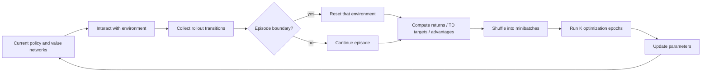

# Reinforcement Learning Fundamentals and Algorithm Guide

> A polished, corrected, and expanded set of notes based on the uploaded whiteboard, `Reinforcement_Learning.md`, and `Hexapod_Reinforcement_Learning.md`.
>
> **Main goal:** understand not only how reinforcement-learning algorithms work, but why different algorithm families exist, what assumptions they make, and how to select an appropriate algorithm for a future task.

---

## Table of Contents

1. [How to Read These Notes](#1-how-to-read-these-notes)
2. [Core Reinforcement-Learning Fundamentals](#2-core-reinforcement-learning-fundamentals)
   - Agent, environment, state, observation, action, reward
   - Reward versus return
   - Policies, probability distributions, log-probabilities, and entropy
   - Trajectory, transition, episode, rollout, batch, epoch, iteration, and optimizer step
3. [Markov Decision Processes](#3-markov-decision-processes-mdps)
4. [Monte Carlo Methods](#4-monte-carlo-methods)
5. [Policy Value, Action Value, and Advantage Functions](#5-policy-value-action-value-and-advantage-functions)
6. [Temporal-Difference Learning](#6-temporal-difference-learning)
7. [Policy-Based, Value-Based, and Actor-Critic Methods](#7-policy-based-value-based-and-actor-critic-methods)
8. [On-Policy and Off-Policy Learning](#8-on-policy-and-off-policy-learning)
9. [Model-Free and Model-Based Reinforcement Learning](#9-model-free-and-model-based-reinforcement-learning)
10. [Deep Q-Network](#10-deep-q-network-dqn)
11. [Proximal Policy Optimization](#11-proximal-policy-optimization-ppo)
12. [Twin Delayed Deep Deterministic Policy Gradient](#12-twin-delayed-deep-deterministic-policy-gradient-td3)
13. [Soft Actor-Critic](#13-soft-actor-critic-sac)
14. [Related Algorithms: TRPO, A2C, and A3C](#14-related-algorithms-trpo-a2c-and-a3c)
15. [How to Choose an Algorithm](#15-how-to-choose-an-algorithm)
16. [Case Studies: 2048 and Hexapod Locomotion](#16-case-studies-2048-and-hexapod-locomotion)
17. [Common Misconceptions and Corrections](#17-common-misconceptions-and-corrections)
18. [Formula Cheat Sheet](#18-formula-cheat-sheet)
19. [Glossary](#19-glossary)

---

# 1. How to Read These Notes

Reinforcement learning becomes confusing when algorithms are learned as unrelated collections of equations. DQN, PPO, TD3, and SAC look very different at first, but most of their components answer a small set of recurring questions:

1. **What information does the agent learn?**
   - A policy, $\pi(a\mid s)$?
   - A state-value function, $V(s)$?
   - An action-value function, $Q(s,a)$?
   - A transition model, $P(s'\mid s,a)$?

2. **What target is used for learning?**
   - A complete return observed after an episode?
   - A bootstrapped temporal-difference target?
   - A policy-gradient objective?
   - A planning result produced by a model?

3. **Where does the training data come from?**
   - The current policy only?
   - Older policies stored in a replay buffer?
   - A known simulator or learned world model?

4. **What action space is supported naturally?**
   - A small discrete set such as up, down, left, and right?
   - Continuous motor commands such as joint targets or torques?

5. **What failure mode is the algorithm trying to prevent?**
   - DQN: unstable bootstrapping with neural networks.
   - PPO: policy updates that are too large.
   - TD3: overestimated critic values and brittle deterministic control.
   - SAC: poor exploration and inefficient use of interaction data.

The recommended approach is therefore:

> **Learn each algorithm as a set of design choices, not as a formula to memorize.**

Throughout these notes, two running examples are used:

- **2048:** a stochastic game with four discrete actions and known transition rules.
- **Hexapod locomotion:** a continuous-control robotics problem that may be trained through massively parallel simulation.

## 1.1 Notation convention

A common source of confusion is inconsistent reward indexing. These notes use the standard transition convention:

$$
(S_t, A_t, R_{t+1}, S_{t+1}).
$$

At time $t$:

1. The agent observes $S_t$ or $O_t$.
2. It chooses action $A_t$.
3. The environment moves to $S_{t+1}$.
4. The environment emits reward $R_{t+1}$.

The discounted return from time $t$ is written as:

$$
G_t = R_{t+1}+\gamma R_{t+2}+\gamma^2R_{t+3}+\cdots.
$$

Some libraries instead store the reward beside index $t$ and call it $r_t$. That is only an indexing convention. The important requirement is to remain consistent.

The symbol $\tau$ is reserved for a trajectory, not for a return:

$$
\tau=(S_0,A_0,R_1,S_1,A_1,R_2,\ldots).
$$

---

# 2. Core Reinforcement-Learning Fundamentals

## 2.1 What is reinforcement learning?

Reinforcement learning is a framework for **sequential decision-making**. An agent repeatedly interacts with an environment, receives consequences, and changes its behaviour so that its long-term outcomes improve.

A useful analogy is learning to ride a bicycle:

- No teacher provides the perfect steering angle for every millisecond.
- You perform an action.
- The bicycle responds.
- You receive feedback such as staying balanced, moving forward, or falling.
- Over repeated attempts, your behaviour improves.

This differs from supervised learning. In supervised learning, the training set typically provides a target label for each input. In reinforcement learning, the agent often receives only a delayed scalar reward. It must determine which earlier actions were responsible for later success or failure. This is the **credit-assignment problem**.

## 2.2 Agent

The **agent** is the decision-making system.

Examples:

- In 2048, the agent chooses up, down, left, or right.
- In chess, the agent chooses a legal move.
- In a hexapod, the agent may output 18 joint targets directly, or a lower-dimensional vector of high-level gait parameters that inverse kinematics converts into joint targets.

The agent is not always identical to one neural network. It may contain:

- An actor network
- One or more critic networks
- A replay buffer
- A learned dynamics model
- An exploration strategy
- A planner
- Observation normalization
- A recurrent memory module

## 2.3 Environment

The **environment** is everything whose dynamics determine what happens after the agent acts.

The agent may influence the environment, but it does not directly set the next state. For example, a robot can command motor torques, but friction, gravity, contacts, terrain, latency, and body dynamics determine the resulting motion.

The environment usually exposes two operations conceptually:

```text
observation = reset()
next_observation, reward, terminated, truncated, info = step(action)
```

A simulator can be part of the environment. Having access to a simulator does **not** automatically make an algorithm model-based. PPO trained in Isaac Lab is still model-free when the agent does not use the simulator's transition equations internally to plan future actions.

## 2.4 Time step and transition

A **time step** is one interaction cycle. A **transition** is the recorded experience from that cycle:

$$
(S_t,A_t,R_{t+1},S_{t+1}).
$$

Many implementations also store:

$$
(S_t,A_t,R_{t+1},S_{t+1},D_{t+1},\log \pi_{\text{old}}(A_t\mid S_t),V_{\text{old}}(S_t)),
$$

where $D_{t+1}$ records whether an episode ended.

A transition is the smallest common unit placed into a DQN, SAC, or TD3 replay buffer.

## 2.5 State

A **state** contains enough information to predict the distribution of the future, provided the next action is known. Formally, a Markov state satisfies:

$$
P(S_{t+1}\mid S_0,A_0,\ldots,S_t,A_t)
=
P(S_{t+1}\mid S_t,A_t).
$$

This does **not** mean that the physical world has no history. It means the state representation summarizes all history that matters for predicting the future.

For a chess game, the complete board configuration, side to move, castling rights, and relevant move-history information together form a state. A board image missing castling rights may not be fully Markov.

For robotics, a state might include:

- Base linear and angular velocity
- Gravity direction in body coordinates
- Joint positions and velocities
- Contact states
- Commanded target velocity
- Previous action
- Terrain information

## 2.6 Observation

An **observation** is the information actually available to the agent:

$$
O_t \sim \Omega(\cdot\mid S_t).
$$

In a fully observable environment, the observation may equal the state:

$$
O_t=S_t.
$$

In a partially observable environment, the observation hides some relevant information. A camera image may not reveal velocity directly. A robot's proprioceptive measurements may not reveal the exact terrain geometry ahead.

This distinction leads to:

- **MDP:** the agent observes a sufficient Markov state.
- **POMDP:** the agent receives incomplete or noisy observations.

A recurrent policy, frame stacking, action history, or belief-state estimator can help recover hidden temporal information.

### Analogy

- **State:** the complete internal game save file.
- **Observation:** the portion shown on the screen.

## 2.7 Action

An **action** is the decision issued by the agent at time $t$.

### Discrete action space

A finite set:

$$
\mathcal A=\{a_1,a_2,\ldots,a_n\}.
$$

Examples:

- 2048: up, down, left, right
- Atari: joystick direction and button choices
- Chess: legal moves in the current position

For a discrete stochastic policy, a neural network commonly outputs logits and applies softmax:

$$
z_\theta(s)\in\mathbb R^{|\mathcal A|},
\qquad
\pi_\theta(a\mid s)=\operatorname{softmax}(z_\theta(s))_a.
$$

### Continuous action space

An interval or vector of real numbers:

$$
\mathcal A\subseteq \mathbb R^d.
$$

Examples:

- Steering angle and acceleration
- Motor torque
- Desired joint position
- High-level gait parameters

For continuous stochastic control, a policy often predicts a Gaussian distribution:

$$
\mu_\theta(s),\log \sigma_\theta(s),
\qquad
u\sim\mathcal N(\mu_\theta(s),\operatorname{diag}(\sigma_\theta^2(s))).
$$

The raw sample may then be squashed into bounded action limits:

$$
a=\tanh(\nu).
$$

PPO frequently uses a Gaussian policy. SAC commonly uses a reparameterized, tanh-squashed Gaussian.

## 2.8 Reward

The **reward** is an immediate scalar feedback signal emitted by the environment:

$$
R_{t+1}=R(S_t,A_t,S_{t+1}).
$$

A reward does not directly say which action is globally optimal. It only evaluates an immediate transition according to the task designer's objective.

Examples:

- 2048: increase in game score after a move
- Robot locomotion: velocity tracking reward, uprightness reward, energy penalty, foot-slip penalty
- Chess: $+1$ for win, $0$ for draw, $-1$ for loss

### Reward is not the same as return

An immediate reward is like the score for one assignment. Return is like the final weighted course result that includes later assignments.

A locally positive reward can still lead to a bad return. For example, a robot could move rapidly for one second but then fall. Conversely, a temporarily negative reward may lead to long-term success, such as moving away from a wall before proceeding toward a goal.

### Reward shaping

Reward shaping adds intermediate guidance. It can accelerate learning, but it can also produce unintended behaviour. The agent optimizes the mathematical reward, not the designer's unstated intention.

Common failure patterns include:

- Rewarding forward speed without penalizing falling, causing diving behaviour
- Rewarding tile merges without preserving empty cells in 2048
- Penalizing energy too strongly, causing the robot not to move
- Using many terms with incompatible scales

A good reward design should be:

- Aligned with the real objective
- Numerically balanced
- Difficult to exploit
- Measurable from available state information
- Tested through ablation studies

## 2.9 Return

The **return** is the accumulated future reward from a particular time step.

For a finite episode ending at time $T$:

$$
G_t=\sum_{k=0}^{T-t-1}\gamma^kR_{t+k+1}.
$$

For a continuing task:

$$
G_t=\sum_{k=0}^{\infty}\gamma^kR_{t+k+1}.
$$

The discount factor satisfies:

$$
0\leq\gamma\leq1.
$$

### What $\gamma$ means

The discount factor is a **geometric weighting factor**. It is not an exponential moving average parameter, even though the powers of $\gamma$ create a superficially similar decay pattern.

- $\gamma=0$: only the immediate reward matters.
- $\gamma=0.9$: a reward ten steps away receives weight $0.9^{10}\approx0.35$.
- $\gamma=0.99$: long-term rewards retain much more influence.
- $\gamma=1$: appropriate for some finite episodic tasks when returns remain well-defined.

Discounting serves several purposes:

1. It expresses preference for earlier reward.
2. It limits the effective planning horizon.
3. It helps ensure convergence in continuing tasks.
4. It reflects uncertainty about distant outcomes.

A rough effective horizon is often interpreted as:

$$
H_{\text{effective}}\approx\frac{1}{1-\gamma}.
$$

Thus $\gamma=0.99$ corresponds loosely to about 100 influential steps, although this is only an intuition.

## 2.10 Policy

A **policy** describes how the agent selects actions.

### Deterministic policy

$$
A_t=\mu_\theta(S_t).
$$

The same state maps to the same action, assuming the network and preprocessing are unchanged.

Examples:

- TD3 actor
- DDPG actor
- Greedy DQN policy during evaluation

### Stochastic policy

$$
A_t\sim\pi_\theta(\cdot\mid S_t).
$$

The policy outputs a probability distribution. The same state can produce different sampled actions.

Examples:

- PPO
- SAC
- REINFORCE
- A2C/A3C

A policy should not be defined as “the function that already selects the best action.” During training, the policy is imperfect. It represents the agent's **current behaviour**, which learning attempts to improve.

### Policy as a neural network

A simple actor network is:

$$
h_1=f(W_1o+b_1),
$$

$$
h_2=f(W_2h_1+b_2),
$$

followed by an output head.

For a discrete actor:

$$
\pi_\theta(\cdot\mid o)=\operatorname{Categorical}(\operatorname{softmax}(W_3h_2+b_3)).
$$

For a Gaussian continuous actor:

$$
\mu_\theta(o)=W_\mu h_2+b_\mu,
$$

$$
\log\sigma_\theta(o)=\operatorname{clip}(W_\sigma h_2+b_\sigma,\ell,u).
$$

In some PPO implementations, $\log\sigma$ is a learned state-independent parameter instead of a network output.

## 2.11 Probability, likelihood, and log-probability

For a stochastic policy, $\pi_\theta(a\mid s)$ is the probability or probability density assigned to action $a$ in state $s$.

In a multidimensional independent Gaussian policy:

$$
\pi_\theta(a\mid s)=\prod_{i=1}^{d}\mathcal N(a_i;\mu_i(s),\sigma_i^2(s)).
$$

Products of many small probabilities can underflow numerically. Taking the logarithm converts products into sums:

$$
\log\pi_\theta(a\mid s)
=
\sum_{i=1}^{d}\log\mathcal N(a_i;\mu_i(s),\sigma_i^2(s)).
$$

The log is monotonic, so an action with higher probability also has higher log-probability. Log-probabilities are useful because:

- Products become sums
- Gradients are easier to compute
- Probability ratios can be computed stably:

$$
\frac{\pi_{\theta}(a\mid s)}{\pi_{\theta_{old}}(a\mid s)}
=
\exp\left(\log\pi_\theta(a\mid s)-\log\pi_{\theta_{old}}(a\mid s)\right)
$$

The main reason is numerical and mathematical convenience, not simply that the log “scales probabilities upward” or prevents ordinary neural-network vanishing gradients.

## 2.12 Entropy

Entropy measures the spread or uncertainty of a stochastic policy.

For a discrete policy:

$$
\mathcal H(\pi(\cdot\mid s))
=-\sum_a\pi(a\mid s)\log\pi(a\mid s).
$$

- Distribution $[0.25,0.25,0.25,0.25]$: high entropy
- Distribution $[0.97,0.01,0.01,0.01]$: low entropy

High entropy means the policy keeps several actions plausible. Low entropy means it concentrates probability on fewer actions.

Entropy is often added as an exploration bonus:

$$
J_{entropy}=J_{reward}+\beta\mathbb E[\mathcal H(\pi(\cdot\mid S_t))].
$$

High entropy is not automatically good. Excessive entropy prevents commitment to a skilled behaviour. Too little entropy too early can trap the agent in a poor local strategy.

## 2.13 Trajectory

A **trajectory** is an ordered sequence generated by interaction:

$$
\tau=(S_0,A_0,R_1,S_1,A_1,R_2,\ldots).
$$

In theoretical writing, trajectory often means a complete path from initial state to termination. In practical code, the term may also refer to a partial sampled sequence. Always check the author's convention.

## 2.14 Episode

An **episode** is an environment-defined sequence from reset until termination or truncation.

Examples:

- One full 2048 game until no legal move remains
- One chess game until win, loss, draw, or move limit
- One robot trial until falling, timeout, or another reset condition

The episode boundary belongs to the environment, not the optimizer.

### Termination versus truncation

Modern APIs distinguish:

- **Terminated:** a true terminal condition was reached, such as falling or checkmate.
- **Truncated:** data collection stopped because of an external limit, such as a time limit.

For true termination, future value is normally zero:

$$
V(S_{t+1})=0.
$$

For time-limit truncation, the underlying task may continue. Bootstrapping from $V(S_{t+1})$ is often appropriate. Treating every truncation as a true terminal state can bias value targets.

## 2.15 Rollout

A **rollout** is data generated by running a policy in one or more environments for some collection window.

A rollout may be:

- One complete episode
- Part of one long episode
- Several short episodes
- A fixed number of steps from thousands of parallel environments

For $N$ parallel environments and rollout length $T$:

$$
N_{samples}=N\times T.
$$

For example:

$$
4096\text{ environments}\times24\text{ steps}=98{,}304\text{ transitions}.
$$

An episode and a rollout are therefore not the same concept.

> **Episode = environment boundary. Rollout = data-collection boundary.**

A long episode can continue across several rollouts. A rollout can contain several episode endings and resets.

## 2.16 Batch, minibatch, epoch, optimizer step, update, and iteration

These terms describe optimization rather than environment progression.

### Batch

The full set of samples selected for a training phase. In PPO, the batch is often the complete rollout:

$$
B=N_{env}\times T.
$$

### Minibatch

A smaller subset used for one gradient computation. If the rollout has $98{,}304$ samples and minibatch size is $4096$, one epoch contains:

$$
\frac{98{,}304}{4096}=24\text{ minibatches}.
$$

### Epoch

One pass through the fixed training batch. If PPO uses five epochs, each rollout sample is reused approximately five times.

### Optimizer step

One parameter update, usually after backpropagating one minibatch loss:

```text
optimizer.zero_grad()
loss.backward()
clip_grad_norm_(parameters, max_norm)   # optional
optimizer.step()
```

With 24 minibatches and five epochs:

$$
N_{gradient\ steps}=24\times5=120.
$$

### Update or iteration

Frameworks use these words differently. In PPO, an iteration commonly means:

1. Collect one fresh rollout
2. Compute advantages and targets
3. Perform several epochs of minibatch optimization
4. Install the updated parameters
5. Repeat

In DQN, an iteration might instead mean one environment step plus one replay-buffer gradient step. Always inspect the implementation.

## 2.17 How episode, rollout, and epoch fit together


The essential cycle is:

1. The current policy interacts with the environment.
2. Transitions are collected into a rollout or replay buffer.
3. Episode boundaries may occur anywhere inside that data.
4. Returns, TD targets, or advantages are computed.
5. The data is shuffled into minibatches.
6. Backpropagation and the optimizer update model parameters.
7. The new parameters generate future behaviour.

### Mermaid fallback



### Why `done` masks matter

Suppose one vectorized rollout contains the end of episode A followed immediately by the reset state of episode B. A value target must not bootstrap from episode B into episode A:

$$
\delta_t=R_{t+1}+\gamma(1-d_{t+1})V(S_{t+1})-V(S_t).
$$

The mask is not mainly preventing “training/test data leakage.” It enforces the mathematical fact that a true terminal state has no future reward from the next episode.

In advanced implementations, use a termination mask rather than blindly combining termination and time-limit truncation.

## 2.18 Exploration versus exploitation

The agent faces a trade-off:

- **Exploration:** try actions whose outcomes are uncertain.
- **Exploitation:** choose actions currently believed to be good.

Common mechanisms include:

- $\epsilon$-greedy action selection in Q-learning and DQN
- Policy entropy bonuses in PPO and A3C
- Stochastic maximum-entropy learning in SAC
- Additive action noise in TD3
- Optimistic initialization or uncertainty bonuses

For $\epsilon$-greedy behaviour:

$$
A_t=
\begin{cases}
\text{random action}, & \text{with probability }\epsilon,\\
\arg\max_a Q(S_t,a), & \text{with probability }1-\epsilon.
\end{cases}
$$

The value $1-\epsilon$ is not itself “the probability of every preferred action.” It is the probability of selecting a greedy action under the basic rule.

---

# 3. Markov Decision Processes (MDPs)

## 3.1 Definition

A Markov Decision Process formalizes a fully observable sequential decision problem. An MDP is commonly written as:

$$
\mathcal M=(\mathcal S,\mathcal A,P,R,\gamma,\rho_0).
$$

Its elements are:

- $\mathcal S$: state space
- $\mathcal A$: action space
- $P(s'\mid s,a)$: transition distribution
- $R(s,a,s')$: reward function or reward distribution
- $\gamma$: discount factor
- $\rho_0(s)$: initial-state distribution

A policy adds a rule for selecting actions:

$$
\pi(a\mid s).
$$

The MDP itself defines the task. The policy defines the agent's current strategy inside that task.

## 3.2 The Markov property

The Markov property states that the current state contains all relevant predictive information:

$$
P(S_{t+1}\mid S_0,A_0,\ldots,S_t,A_t)
=
P(S_{t+1}\mid S_t,A_t).
$$

This is often misunderstood as “the next state depends only on the immediately previous physical moment.” A better interpretation is:

> Once the current state is known, older history provides no additional information needed to predict the next-state distribution.

If history remains useful, the supplied representation is not a complete Markov state. The solution may be to add velocity, previous actions, recurrent memory, or other hidden variables.

## 3.3 MDP interaction loop

At each step:

$$
S_t \xrightarrow{\pi} A_t
\xrightarrow{P,R} (R_{t+1},S_{t+1}).
$$

The policy chooses an action, while the environment's transition and reward rules determine the consequence.

The agent's objective is usually to maximize expected discounted return:

$$
J(\pi)=\mathbb E_{\tau\sim\pi}[G_0].
$$

The expectation is necessary because randomness may arise from:

- Initial states
- Stochastic policies
- Environment transitions
- Sensor noise
- Random disturbances

## 3.4 Bellman expectation equation

The Bellman equation decomposes a long-term value into immediate reward plus the value of the next state.

For a state-value function:

$$
V^\pi(s)
=
\mathbb E_\pi\left[R_{t+1}+\gamma V^\pi(S_{t+1})\mid S_t=s\right].
$$

Expanded over actions and next states:

$$
V^\pi(s)
=
\sum_a\pi(a\mid s)
\sum_{s'}P(s'\mid s,a)
\left[R(s,a,s')+\gamma V^\pi(s')\right].
$$

For an action-value function:

$$
Q^\pi(s,a)
=
\mathbb E\left[
R_{t+1}+\gamma\mathbb E_{A_{t+1}\sim\pi}[Q^\pi(S_{t+1},A_{t+1})]
\mid S_t=s,A_t=a
\right].
$$

### Analogy

Suppose a route's total quality equals:

- The immediate road condition on the first segment
- Plus the discounted quality of the remaining route

Bellman equations apply this recursive decomposition to decision-making.

## 3.5 Bellman optimality equation

The optimal value functions assume that the best possible decisions are made from the next state onward:

$$
V^*(s)=\max_a\mathbb E[R_{t+1}+\gamma V^*(S_{t+1})\mid s,a],
$$

$$
Q^*(s,a)
=
\mathbb E\left[R_{t+1}+\gamma\max_{a'}Q^*(S_{t+1},a')\mid s,a\right].
$$

An optimal policy can be recovered from $Q^*$:

$$
\pi^*(s)\in\arg\max_aQ^*(s,a).
$$

This is the conceptual foundation of Q-learning and DQN.

## 3.6 Policy evaluation and policy improvement

Many RL algorithms alternate between two conceptual operations:

### Policy evaluation

Estimate how good the current policy is:

$$
V^\pi \quad\text{or}\quad Q^\pi.
$$

### Policy improvement

Change behaviour so actions with better values become more likely.

In value iteration, evaluation and improvement are merged through Bellman optimality updates. In actor-critic algorithms, the critic evaluates while the actor improves.

This produces the broad idea of **generalized policy iteration**:

```text
Evaluate current behaviour  <---->  Improve current behaviour
```

The two processes do not need to complete perfectly before alternating.

## 3.7 MDP example: 2048

A simplified 2048 MDP can be defined as:

- State: complete $4\times4$ board
- Actions: up, down, left, right
- Transition: slide and merge tiles, then spawn a random tile
- Reward: score gained from merges
- Terminal condition: no legal move

The transition is stochastic because the new tile position and value are random. The game rules are known, so model-based planning such as expectimax can explicitly represent player decision nodes and random chance nodes.

A subtle issue is whether an illegal move leaves the board unchanged or is masked out. The environment definition must specify this consistently.

## 3.8 MDP/POMDP example: hexapod locomotion

The full simulator state includes all body positions, velocities, contacts, and terrain properties. The policy may receive only proprioceptive observations. Therefore, the learning problem may be better viewed as partially observable even when it is implemented through an MDP-style API.

Adding previous actions, phase variables, estimated gravity, and joint velocities helps make the observation more informative. A recurrent actor can further integrate history.

## 3.9 MDP is a task model, not a learning algorithm

An MDP is the mathematical problem description. DQN, PPO, SAC, Monte Carlo control, and value iteration are different methods for solving or approximating solutions to an MDP.

Saying “the MDP chooses an action” is therefore imprecise. The policy chooses actions; the MDP defines their possible consequences.

---

# 4. Monte Carlo Methods

## 4.1 Core idea

Monte Carlo reinforcement learning estimates values from **complete sampled returns** rather than bootstrapping from an existing value estimate.

Suppose an episode produces:

$$
S_0,A_0,R_1,S_1,A_1,R_2,\ldots,S_T.
$$

After the episode ends, the return from time $t$ is known:

$$
G_t=R_{t+1}+\gamma R_{t+2}+\cdots+\gamma^{T-t-1}R_T.
$$

Monte Carlo prediction treats $G_t$ as a sample target for $V^\pi(S_t)$ or $Q^\pi(S_t,A_t)$.

### Analogy

Monte Carlo learning is like evaluating a chess decision only after the full game is complete. It does not ask a partially trained critic to estimate the unfinished game. This avoids bootstrap bias but may create high variance because many later events affect the final result.

## 4.2 Monte Carlo prediction for $V^\pi$

The value definition is:

$$
V^\pi(s)=\mathbb E_\pi[G_t\mid S_t=s].
$$

A sample-average estimate is:

$$
V(s)=\frac{1}{N(s)}\sum_{i=1}^{N(s)}G^{(i)}(s).
$$

This can be updated incrementally:

$$
N(s)\leftarrow N(s)+1,
$$

$$
V(s)\leftarrow V(s)+\frac{1}{N(s)}[G_t-V(s)].
$$

For nonstationary settings or function approximation, use a constant step size:

$$
V(s)\leftarrow V(s)+\alpha[G_t-V(s)].
$$

The quantity:

$$
G_t-V(s)
$$

is the prediction error for that sample.

## 4.3 First-visit versus every-visit Monte Carlo

A state can appear multiple times within one episode.

### First-visit MC

Update a state's value only from the first occurrence in each episode.

### Every-visit MC

Update from every occurrence.

Both converge under suitable conditions in tabular episodic settings. Every-visit MC uses more correlated samples; first-visit MC has a cleaner interpretation as one return per episode for each state.

## 4.4 Monte Carlo action-value prediction

Without a model, estimating $Q^\pi(s,a)$ is often more useful than $V^\pi(s)$ because action selection requires comparing actions:

$$
Q^\pi(s,a)=\mathbb E_\pi[G_t\mid S_t=s,A_t=a].
$$

The update is:

$$
Q(s,a)\leftarrow Q(s,a)+\alpha[G_t-Q(s,a)].
$$

A greedy policy can then choose:

$$
\pi(s)=\arg\max_aQ(s,a).
$$

## 4.5 Monte Carlo control

Monte Carlo control alternates:

1. Generate episodes using the current behaviour policy.
2. Estimate action values from complete returns.
3. Improve the policy toward actions with higher estimated values.

A simple $\epsilon$-greedy policy is:

$$
\pi(a\mid s)=
\begin{cases}
1-\epsilon+\frac{\epsilon}{|\mathcal A(s)|}, & a\in\arg\max_{a'}Q(s,a'),\\
\frac{\epsilon}{|\mathcal A(s)|}, & \text{otherwise}.
\end{cases}
$$

The small random probability ensures that every action continues to be explored.

### Simplified on-policy Monte Carlo control

```text
Initialize Q(s,a) arbitrarily
Initialize an epsilon-soft policy pi

Repeat for each episode:
    Generate a complete episode using pi
    Compute returns backward
    For each visited state-action pair:
        Q(s,a) <- Q(s,a) + alpha * [G - Q(s,a)]
    Make pi epsilon-greedy with respect to Q
```

## 4.6 Exploring starts

Classical Monte Carlo control proofs sometimes assume **exploring starts**: every state-action pair has a nonzero probability of being the starting pair.

This is unrealistic in many real environments. Modern methods more often use $\epsilon$-soft policies, entropy, intrinsic motivation, or other exploration mechanisms.

## 4.7 Off-policy Monte Carlo and importance sampling

Off-policy Monte Carlo evaluates or improves a target policy $\pi$ using episodes generated by another behaviour policy $\mu$.

A trajectory's importance ratio from time $t$ is:

$$
\rho_{t:T-1}
=
\prod_{k=t}^{T-1}
\frac{\pi(A_k\mid S_k)}{\mu(A_k\mid S_k)}.
$$

This ratio corrects the distribution mismatch. Ordinary importance sampling uses:

$$
V(s)\approx\frac{1}{N}\sum_i\rho_iG_i.
$$

Weighted importance sampling normalizes by the total weight:

$$
V(s)\approx
\frac{\sum_i\rho_iG_i}{\sum_i\rho_i}.
$$

Importance sampling can have extremely high variance because products of many ratios can become huge or nearly zero. This is one reason long-horizon off-policy policy-gradient learning is difficult.

## 4.8 Strengths of Monte Carlo learning

- Does not require transition probabilities
- Does not bootstrap from an imperfect estimate
- Conceptually simple
- Targets are unbiased samples of the true return under the sampled policy
- Useful for episodic games and policy-gradient derivations

## 4.9 Weaknesses

- Must normally wait for episode completion
- High variance, especially with long or stochastic episodes
- Slow credit assignment
- Difficult for continuing tasks
- Rare states may require many episodes
- Full return can change drastically because of events far in the future

## 4.10 Monte Carlo versus temporal-difference learning

| Property | Monte Carlo | Temporal Difference |
|---|---|---|
| Update time | After complete return is available | After one or several steps |
| Bootstrap | No | Yes |
| Bias | Low target bias under sampled policy | Bootstrap target can be biased |
| Variance | Usually higher | Usually lower |
| Continuing tasks | Awkward | Natural |
| Credit speed | Delayed | Faster |

Monte Carlo and TD are not competing “families” in every context. They are endpoints of a spectrum. $n$-step returns and TD($\lambda$) blend them.

## 4.11 Monte Carlo and policy gradients

REINFORCE is a Monte Carlo policy-gradient algorithm because it weights log-probability gradients with sampled returns:

$$
\nabla_\theta J(\theta)
\approx
\sum_t\nabla_\theta\log\pi_\theta(A_t\mid S_t)G_t.
$$

Actor-critic algorithms replace or complement the full Monte Carlo return with learned critic estimates, reducing variance at the cost of some bias.

## 4.12 Monte Carlo for 2048

A complete 2048 episode can be long, and random tile spawning creates large return variance. Tabular Monte Carlo is impossible because the state space is enormous. Neural Monte Carlo control is possible, but DQN-style TD learning usually assigns credit more efficiently.

Monte Carlo evaluation remains useful for measuring a fixed policy: play many complete games and report the distribution of total scores and highest tiles.

---

# 5. Policy Value, Action Value, and Advantage Functions

Value functions convert uncertain future outcomes into quantities that can be learned and compared.

## 5.1 Policy value function $V^\pi(s)$

The **state-value function** under policy $\pi$ is:

$$
V^\pi(s)=\mathbb E_\pi[G_t\mid S_t=s].
$$

It answers:

> If the agent is in state $s$ and follows policy $\pi$ from now onward, what discounted return should it expect?

The superscript $\pi$ matters. A state can have different values under different policies.

### Analogy

Imagine standing in a neighbourhood and asking, “How good is it to be here if I continue using my current driving strategy?” That overall desirability is $V^\pi(s)$.

### Example: 2048

A board with many empty cells, its largest tiles arranged along an edge, and several merge opportunities may have a high $V^\pi(s)$. However, its exact value depends on what the current policy tends to do next.

### Example: hexapod

A state with low tilt, stable contacts, and velocity close to the command may have a high predicted value if the current policy can maintain that behaviour.

## 5.2 Action-value function $Q^\pi(s,a)$

The **action-value function** is:

$$
Q^\pi(s,a)=\mathbb E_\pi[G_t\mid S_t=s,A_t=a].
$$

It answers:

> If the agent takes action $a$ now and then follows policy $\pi$, what return should it expect?

$Q$ is more action-specific than $V$.

### Analogy

$V^\pi(s)$ asks how good the current neighbourhood is overall. $Q^\pi(s,a)$ asks how good it is to take one particular road from that neighbourhood and then continue with the current driving strategy.

## 5.3 Relationship between $V^\pi$ and $Q^\pi$

The state value is the policy-weighted average of action values:

$$
V^\pi(s)=\sum_a\pi(a\mid s)Q^\pi(s,a)
$$

for discrete actions, or:

$$
V^\pi(s)=\int_\mathcal A\pi(a\mid s)Q^\pi(s,a)\,da
$$

for continuous actions.

The action value can be decomposed into one immediate transition and the next state's value:

$$
Q^\pi(s,a)
=
\mathbb E\left[R_{t+1}+\gamma V^\pi(S_{t+1})\mid S_t=s,A_t=a\right].
$$

## 5.4 Advantage function $A^\pi(s,a)$

The advantage function is:

$$
A^\pi(s,a)=Q^\pi(s,a)-V^\pi(s).
$$

It answers:

> How much better or worse is action $a$ than the policy's average action in state $s$?

Interpretation:

- $A^\pi(s,a)>0$: better than the policy's average behaviour at $s$
- $A^\pi(s,a)<0$: worse than average
- $A^\pi(s,a)=0$: exactly average under the current policy

Because $V^\pi(s)$ is the policy-weighted mean of $Q^\pi(s,a)$:

$$
\mathbb E_{A\sim\pi(\cdot\mid s)}[A^\pi(s,A)]=0.
$$

This centring property makes the advantage a useful policy-gradient signal.

## 5.5 Why use advantage instead of raw return?

Suppose two actions occur in a naturally excellent state. Both may produce high returns, but one may still be worse than the policy's typical choice. Using raw return alone can over-credit it.

Subtracting a baseline gives a relative signal:

$$
G_t-b(S_t).
$$

Choosing:

$$
b(S_t)=V^\pi(S_t)
$$

produces an advantage estimate. The baseline reduces variance without changing the expected policy gradient, provided it does not depend on the sampled action in an invalid way.

### Example

Assume:

$$
V^\pi(s)=100.
$$

Two sampled actions produce estimated returns:

- Action A: $110$, advantage $+10$
- Action B: $90$, advantage $-10$

Both raw returns are positive, but the advantage correctly says that B was worse than expected for that state.

## 5.6 Optimal value functions

The optimal state value is:

$$
V^*(s)=\max_\pi V^\pi(s).
$$

The optimal action value is:

$$
Q^*(s,a)=\max_\pi Q^\pi(s,a).
$$

They answer what can be achieved by the best possible future policy, not merely the current one.

For discrete actions:

$$
V^*(s)=\max_aQ^*(s,a).
$$

DQN approximates $Q^*$, while a PPO critic normally approximates $V^{\pi_\theta}$ for the current actor.

## 5.7 What different algorithms learn

| Algorithm | Main learned quantities |
|---|---|
| Tabular Q-learning | $Q^*(s,a)$ |
| DQN | Neural approximation $Q_\theta(s,a)\approx Q^*(s,a)$ |
| REINFORCE | Policy $\pi_\theta$; optional baseline |
| PPO | Actor $\pi_\theta$ and usually critic $V_\phi$ |
| TD3 | Deterministic actor $\mu_\theta$ and two critics $Q_{\phi_1},Q_{\phi_2}$ |
| SAC | Stochastic actor $\pi_\theta$ and usually two soft Q critics |

## 5.8 Does PPO calculate $Q$?

Standard PPO usually trains a $V$ critic rather than an explicit $Q$ network. It estimates advantages with GAE and constructs a return target:

$$
\hat G_t=\hat A_t+V_{\phi_{old}}(S_t).
$$

Conceptually:

$$
Q^\pi(s,a)=A^\pi(s,a)+V^\pi(s).
$$

However, saying PPO “calculates $Q$ by adding $A$ and $V$” can be misleading. In typical code, there is no separately optimized Q-function. $\hat A_t+V(S_t)$ is primarily a target for the value critic.

## 5.9 Value functions are predictions, not rewards

A value function does not generate the environment reward. It predicts long-term return. The reward comes from the environment; the value function is learned from rewards and future-value targets.

This distinction matters in reward design and debugging:

- Incorrect reward: task specification problem
- Inaccurate critic: prediction/optimization problem
- Poor actor despite accurate critic: policy optimization or exploration problem

---

# 6. Temporal-Difference Learning

Temporal-difference learning bridges Monte Carlo methods and dynamic programming. It learns from sampled experience like Monte Carlo, while bootstrapping from current value estimates like dynamic programming.

## 6.1 TD(0) prediction

The one-step target for $V^\pi$ is:

$$
Y_t^{TD}=R_{t+1}+\gamma V(S_{t+1}).
$$

The TD error is:

$$
\delta_t=R_{t+1}+\gamma V(S_{t+1})-V(S_t).
$$

The tabular update is:

$$
V(S_t)\leftarrow V(S_t)+\alpha\delta_t.
$$

For terminal transitions:

$$
\delta_t=R_{t+1}-V(S_t).
$$

With a mask $m_{t+1}$ that equals zero at a true terminal state:

$$
\delta_t=R_{t+1}+\gamma m_{t+1}V(S_{t+1})-V(S_t).
$$

### Analogy

- Monte Carlo: wait until the whole football match ends before evaluating an early play.
- TD: update the evaluation after the next play by using the scoreboard plus the current prediction of the remaining match.

## 6.2 Bootstrapping

Bootstrapping means updating one estimate using another estimate:

$$
V(S_t)\leftarrow R_{t+1}+\gamma V(S_{t+1}).
$$

Advantages:

- Faster updates
- Works in continuing tasks
- Usually lower variance than full returns

Disadvantages:

- Targets can be biased
- Errors can propagate through other estimates
- Combining bootstrapping, function approximation, and off-policy learning can be unstable

The last combination is called the **deadly triad**.

## 6.3 SARSA

SARSA learns an action-value function for the policy currently used to act. Its name comes from the transition tuple:

$$
S_t,A_t,R_{t+1},S_{t+1},A_{t+1}.
$$

The target is:

$$
Y_t^{SARSA}=R_{t+1}+\gamma Q(S_{t+1},A_{t+1}).
$$

The update is:

$$
Q(S_t,A_t)\leftarrow Q(S_t,A_t)+\alpha[Y_t^{SARSA}-Q(S_t,A_t)].
$$

Because $A_{t+1}$ is sampled from the current behaviour policy, SARSA is on-policy.

### Intuition

If the behaviour policy is $\epsilon$-greedy, SARSA learns the value of behaving with that exploration risk included. It may therefore prefer safer paths.

## 6.4 Q-learning

Q-learning uses a greedy bootstrap target:

$$
Y_t^{Q}=R_{t+1}+\gamma\max_{a'}Q(S_{t+1},a').
$$

The update is:

$$
Q(S_t,A_t)\leftarrow Q(S_t,A_t)+\alpha[Y_t^Q-Q(S_t,A_t)].
$$

The behaviour policy can be exploratory, but the target assumes greedy future actions. Therefore, Q-learning is off-policy.

### SARSA versus Q-learning analogy

Imagine learning a route near a cliff:

- SARSA evaluates what will happen while continuing to follow an exploratory driver who may make random turns. It may learn a safer route farther from the cliff.
- Q-learning evaluates the greedy ideal route after the current action. It may learn the shortest route close to the cliff, assuming future greedy choices.

## 6.5 Expected SARSA

Expected SARSA averages over next actions instead of sampling one:

$$
Y_t^{ExpSARSA}
=
R_{t+1}+\gamma\sum_{a'}\pi(a'\mid S_{t+1})Q(S_{t+1},a').
$$

This can reduce variance relative to ordinary SARSA.

## 6.6 $n$-step returns

One-step TD looks ahead one reward. Monte Carlo looks to the end. An $n$-step target lies between them:

$$
G_{t:t+n}
=
R_{t+1}+\gamma R_{t+2}+\cdots+\gamma^{n-1}R_{t+n}
+\gamma^nV(S_{t+n}).
$$

- Small $n$: more bootstrapping, lower variance, potentially more bias
- Large $n$: less bootstrapping, higher variance, more delayed learning

A3C commonly uses $n$-step returns. DQN variants can also use multi-step targets.

## 6.7 TD($\lambda$) and eligibility traces

TD($\lambda$) combines returns from many horizons. The forward view uses the $\lambda$-return:

$$
G_t^\lambda
=(1-\lambda)\sum_{n=1}^{\infty}\lambda^{n-1}G_{t:t+n}.
$$

- $\lambda=0$: one-step TD
- $\lambda\rightarrow1$: approaches Monte Carlo in episodic settings

The backward view uses eligibility traces to assign credit to recently visited states.

## 6.8 GAE as a TD-style advantage estimator

Generalized Advantage Estimation applies an exponentially weighted sum of TD residuals:

$$
\delta_t
=
R_{t+1}+\gamma m_{t+1}V(S_{t+1})-V(S_t),
$$

$$
\hat A_t^{GAE(\gamma,\lambda)}
=
\delta_t+\gamma\lambda m_{t+1}\hat A_{t+1}.
$$

Equivalently:

$$
\hat A_t
=
\sum_{l=0}^{\infty}(\gamma\lambda)^l\delta_{t+l}
$$

within an episode or rollout boundary.

GAE trades bias and variance through $\lambda$:

- Lower $\lambda$: more reliance on critic bootstrapping; lower variance, more bias
- Higher $\lambda$: longer return information; higher variance, less bootstrap bias

**Important correction:** GAE does not itself normalize advantages. Implementations often perform a separate normalization step:

$$
\hat A_t\leftarrow\frac{\hat A_t-\mu_A}{\sigma_A+\varepsilon}.
$$

## 6.9 Backward computation

GAE is usually computed backward because $\hat A_t$ depends on $\hat A_{t+1}$:

```text
last_advantage = 0
for t from T-1 down to 0:
    delta = reward[t] + gamma * mask[t] * value[t+1] - value[t]
    advantage[t] = delta + gamma * lambda * mask[t] * last_advantage
    last_advantage = advantage[t]
return_target[t] = advantage[t] + value[t]
```

The backward loop is an efficient dynamic-programming calculation. It does not mean the agent literally travels backward through time.

## 6.10 Monte Carlo, TD, and dynamic programming comparison

| Method | Requires model? | Requires full episode? | Bootstraps? | Uses sampled transitions? |
|---|---:|---:|---:|---:|
| Dynamic programming | Yes | No | Yes | No; uses expectations over model |
| Monte Carlo | No | Usually yes | No | Yes |
| TD learning | No | No | Yes | Yes |

TD learning is the foundation of DQN critics, PPO critics, TD3 critics, and SAC critics.

---

# 7. Policy-Based, Value-Based, and Actor-Critic Methods

These categories describe **what is represented and optimized**. They overlap with on/off-policy and model-based/model-free classifications.

## 7.1 Taxonomy warning

An algorithm can belong to several categories simultaneously:

- DQN: model-free, value-based, off-policy
- PPO: model-free, actor-critic, mostly on-policy
- TD3: model-free, actor-critic, off-policy, deterministic actor
- SAC: model-free, actor-critic, off-policy, stochastic maximum-entropy actor

“Policy-based versus action-based” is not the usual comparison. The standard phrase is **policy-based versus value-based**. Value-based algorithms often learn an action-value function, so “action-value based” may be what was intended.

## 7.2 Value-based methods

A value-based method learns a value function and derives behaviour from it.

For discrete actions, a Q-network maps one state to one score per action:

$$
f_\theta(s)
ightarrow
[Q_\theta(s,a_1),\ldots,Q_\theta(s,a_{|\mathcal A|})].
$$

The greedy policy is implicit:

$$
\pi_\theta(s)=\arg\max_aQ_\theta(s,a).
$$

### Model structure

```text
State / observation
       |
   Q-network
       |
Q(s,a1), Q(s,a2), ..., Q(s,an)
       |
argmax or epsilon-greedy selection
```

### Core objective

Value methods minimize a Bellman error. For DQN:

$$
L_Q(\theta)=
\mathbb E\left[
\ell\left(Q_\theta(S_t,A_t),Y_t\right)
\right],
$$

with target:

$$
Y_t=R_{t+1}+\gamma m_{t+1}\max_{a'}Q_{\bar\theta}(S_{t+1},a').
$$

Here $\bar\theta$ denotes target-network parameters.

### Strengths

- Natural for small or moderate discrete action spaces
- Reuses data efficiently through replay
- No separate actor is needed
- Action comparison is explicit
- Deterministic evaluation is straightforward

### Weaknesses

- Standard argmax becomes difficult for high-dimensional continuous actions
- Q estimates can be overoptimistic
- Bootstrapping plus function approximation can be unstable
- Exploration often requires an additional rule such as $\epsilon$-greedy
- Output size grows with number of discrete actions

### Why standard DQN is not for continuous actions

To choose a greedy continuous action, one would need:

$$
\arg\max_{a\in\mathbb R^d}Q(s,a).
$$

This is a continuous optimization problem at every time step. Actor-critic methods avoid it by learning a separate actor that proposes an action directly.

## 7.3 Pure policy-based methods

A policy-based method directly parameterizes behaviour:

$$
\pi_\theta(a\mid s).
$$

The objective is expected return:

$$
J(\theta)=\mathbb E_{\tau\sim\pi_\theta}[G_0].
$$

### Policy-gradient derivation

The trajectory probability is:

$$
p_\theta(\tau)
=
\rho_0(S_0)
\prod_{t=0}^{T-1}
\pi_\theta(A_t\mid S_t)
P(S_{t+1}\mid S_t,A_t).
$$

Only the policy depends on $\theta$. Using the log-derivative identity:

$$
\nabla_\theta p_\theta(\tau)
=
p_\theta(\tau)\nabla_\theta\log p_\theta(\tau),
$$

and:

$$
\nabla_\theta\log p_\theta(\tau)
=
\sum_t\nabla_\theta\log\pi_\theta(A_t\mid S_t),
$$

we obtain the policy-gradient form:

$$
\nabla_\theta J(\theta)
=
\mathbb E_{\tau\sim\pi_\theta}
\left[
\sum_t\nabla_\theta\log\pi_\theta(A_t\mid S_t)G_t
\right].
$$

Using the return from time $t$ rather than the full episode return for every action reflects causality: actions cannot influence rewards that occurred before them.

With a baseline:

$$
\nabla_\theta J(\theta)
=
\mathbb E\left[
\nabla_\theta\log\pi_\theta(A_t\mid S_t)
\left(G_t-b(S_t)\right)
\right].
$$

REINFORCE uses sampled Monte Carlo returns. A pure policy method may have no learned critic, although it can still use a nonlearned baseline.

### Policy loss used in code

Optimizers minimize, so gradient ascent on return becomes minimization of:

$$
L_{policy}(\theta)
=-\mathbb E\left[
\log\pi_\theta(A_t\mid S_t)\hat A_t
\right].
$$

- Positive advantage: minimizing loss increases the action's log-probability
- Negative advantage: minimizing loss decreases it

### Strengths

- Directly represents stochastic behaviour
- Natural for continuous action spaces
- Can optimize non-greedy stochastic policies
- Avoids explicit maximization over actions

### Weaknesses

- Monte Carlo gradients can have high variance
- Usually less sample-efficient when on-policy
- Updates can collapse or change behaviour too aggressively
- Learning depends strongly on advantage estimation and normalization

## 7.4 Actor-critic methods

Actor-critic combines a policy actor and value critic.

### Model structure

```text
                 State / observation
                    /          \
              Actor             Critic
        pi_theta(a|s)       V_phi(s) or Q_phi(s,a)
               |                   |
        choose action       evaluate behaviour
               \                   /
                 policy improvement signal
```

The actor answers:

> What action should I take?

The critic answers:

> How promising was the state or action relative to expectation?

### Basic state-value actor-critic

The critic target may be:

$$
Y_t=R_{t+1}+\gamma m_{t+1}V_{\phi^-}(S_{t+1}).
$$

Critic loss:

$$
L_V(\phi)=\mathbb E[(V_\phi(S_t)-Y_t)^2].
$$

Actor loss:

$$
L_\pi(\theta)
=-\mathbb E[\log\pi_\theta(A_t\mid S_t)\hat A_t].
$$

A one-step advantage estimate can be the TD error:

$$
\hat A_t=R_{t+1}+\gamma V_\phi(S_{t+1})-V_\phi(S_t).
$$

PPO uses a clipped version of the actor objective and often GAE. TD3 and SAC use Q critics rather than a V critic in their common modern forms.

### Shared versus separate networks

An actor and critic can:

- Use completely separate networks
- Share an observation encoder and have separate output heads

Shared encoders reduce computation but create gradient interference: actor and critic losses may want different features. Separate networks cost more but isolate optimization.

### Why actor-critic reduces variance

A learned critic provides a state-dependent baseline and faster bootstrapped feedback. Compared with full-return REINFORCE, actor-critic gradients are usually less noisy.

The trade-off is that an inaccurate critic introduces bias. The actor can improve only as reliably as the critic's learning signal.

## 7.5 Objective-function comparison

### Value based

$$
\min_\theta
\mathbb E[(Q_\theta(S,A)-Y)^2].
$$

The policy is derived from the learned Q values.

### Pure policy gradient

$$
\max_\theta J(\theta)
\quad\Longleftrightarrow\quad
\min_\theta-
\mathbb E[\log\pi_\theta(A\mid S)G].
$$

### Actor-critic

```math
\min_{\theta,\phi}
\underbrace{L_{actor}(\theta;\hat A_\phi)}_{\text{improve policy}}
+
 c_v\underbrace{L_{critic}(\phi)}_{\text{predict return}}
-
 c_e\underbrace{\mathcal H(\pi_\theta)}_{\text{encourage exploration}}.
```

Signs vary by implementation because some libraries maximize objectives while others minimize losses.

## 7.6 Comparison table

| Property | Value-based | Pure policy-based | Actor-critic |
|---|---|---|---|
| Learns explicit policy? | Usually implicit | Yes | Yes |
| Learns value function? | Yes | Not necessarily | Yes |
| Typical action space | Discrete | Discrete or continuous | Discrete or continuous |
| Main target | Bellman target | Return-weighted log-probability | Actor objective plus critic target |
| Exploration | External, e.g. $\epsilon$-greedy | Policy stochasticity/entropy | Policy stochasticity, entropy, or action noise |
| Sample efficiency | Often strong off-policy | Often weaker on-policy | Depends on on/off-policy design |
| Examples | Q-learning, DQN | REINFORCE | PPO, A3C, TD3, SAC |

## 7.7 Important overlap: PPO is actor-critic

PPO is often introduced under “policy optimization,” but the standard practical implementation contains:

- A stochastic actor
- A value critic
- Advantage estimation
- Actor loss
- Value loss
- Entropy regularization

Therefore, PPO is best described as an **on-policy actor-critic policy-optimization algorithm**.

## 7.8 Which family fits 2048?

2048 has four discrete actions. A DQN can output four action values efficiently. A policy-gradient method can also output four probabilities, but its on-policy versions generally reuse data less efficiently.

DQN is therefore a natural learning baseline. However, because the rules are known, model-based expectimax is also highly relevant.

## 7.9 Which family fits hexapod control?

For continuous actions:

- PPO directly parameterizes a Gaussian action policy and works well with massive parallel simulation.
- TD3 learns a deterministic actor and reuses replay data.
- SAC learns a stochastic maximum-entropy actor and is often more sample-efficient.

The best choice depends on whether interactions are cheap, whether exploration must be safe, and whether training occurs in simulation or on hardware.

---

# 8. On-Policy and Off-Policy Learning

On-policy versus off-policy describes the relationship between the policy that generates data and the policy being evaluated or improved.

## 8.1 Behaviour policy and target policy

Let:

- $\mu(a\mid s)$ be the **behaviour policy** that collects data.
- $\pi(a\mid s)$ be the **target policy** being learned or evaluated.

### On-policy

$$
\mu=\pi
$$

or the data is sufficiently close to the current target policy for the update's assumptions.

### Off-policy

$$
\mu\neq\pi.
$$

The algorithm learns about one policy using experience generated by another.

These policies are conceptual roles. Off-policy learning does not always require two explicit policy neural networks.

## 8.2 On-policy learning

An on-policy algorithm collects experience using the current policy, updates it, and then collects new experience.

Examples:

- SARSA
- REINFORCE
- A2C/A3C
- TRPO
- PPO

### Typical cycle

```text
Current policy pi_old
        |
collect fresh rollout
        |
estimate returns / advantages
        |
perform a limited update to pi_new
        |
discard or stop relying on rollout
        |
collect new data with pi_new
```

### Advantages

- Data distribution closely matches the learned policy
- Policy-gradient mathematics is simpler
- Often robust with parallel simulation
- Less severe replay distribution shift
- Easy to combine with stochastic actors

### Disadvantages

- Old data has limited reuse
- Requires many environment interactions
- Poor fit when real-world samples are expensive
- Updating too many epochs on one rollout makes data increasingly stale

On-policy does not universally mean “faster convergence” or “more stable.” Stability depends on algorithm, hyperparameters, environment, network, and data scale. PPO is often stable because of its constrained update design, not merely because it is on-policy.

## 8.3 Why PPO can reuse a rollout for multiple epochs and remain called on-policy

PPO stores data generated by $\pi_{old}$ and optimizes a new policy using the importance ratio:

$$
r_t(\theta)=
\frac{\pi_\theta(A_t\mid S_t)}{\pi_{old}(A_t\mid S_t)}.
$$

This correction permits a small amount of reuse. Clipping discourages the new policy from moving too far from the data-generating policy.

PPO is sometimes called **approximately on-policy** because:

- It uses recently collected data
- Reuse is limited to a few epochs
- The old-policy likelihood is explicitly tracked
- The batch is normally discarded after the update

If hundreds of epochs were run on one rollout, the policy could drift so far that the approximation becomes poor.

## 8.4 Off-policy learning

Off-policy methods can learn from:

- Older versions of the agent
- An exploratory policy
- Demonstrations
- Another controller
- A replay buffer containing mixed behaviour

Examples:

- Q-learning
- DQN
- DDPG
- TD3
- SAC

### Typical replay cycle

```text
Behaviour policy interacts with environment
              |
       store transition
              v
        replay buffer
              |
     sample random minibatch
              |
 update critic and possibly actor
              |
 repeat; old data may remain useful
```

### Advantages

- Better data reuse
- Higher sample efficiency
- Breaks temporal correlation through random replay sampling
- Can learn from demonstrations or multiple behaviour sources
- Suitable for expensive physical interaction

### Disadvantages

- Distribution mismatch
- Old data may poorly cover the current policy's states
- Importance correction may be difficult
- Q-learning can suffer from extrapolation error
- Hyperparameters such as replay ratio and target updates matter greatly

Old data does not simply “pollute” learning. It becomes dangerous when the update incorrectly evaluates actions or states not supported by the dataset.

## 8.5 SARSA versus Q-learning as the clearest comparison

### SARSA target

$$
Y_t=R_{t+1}+\gamma Q(S_{t+1},A_{t+1}),
\quad A_{t+1}\sim\pi.
$$

The target evaluates the same policy used for behaviour.

### Q-learning target

$$
Y_t=R_{t+1}+\gamma\max_{a'}Q(S_{t+1},a').
$$

The behaviour may be exploratory, but the target learns the greedy policy. That separation makes Q-learning off-policy.

## 8.6 Experience replay

A replay buffer stores transitions:

$$
\mathcal D=\{(s,a,r,s',d)\}.
$$

A minibatch is sampled:

$$
(s_i,a_i,r_i,s'_i,d_i)\sim\mathcal D.
$$

Benefits:

1. Reuse of expensive experience
2. Reduced temporal correlation
3. More stationary training distribution than consecutive online samples
4. Ability to mix data across many episodes

Risks:

- Very old data may be irrelevant
- Rare but important transitions may be undersampled
- Buffer composition can bias learning
- Offline-like distribution gaps can appear

Prioritized replay samples transitions with large TD errors more often, but it requires importance weights to reduce introduced bias.

## 8.7 Target networks are not target policies

DQN, TD3, and SAC use slowly updated target networks. These should not be confused with the target policy in the on/off-policy definition.

A target network is a delayed copy used to stabilize bootstrapped targets:

$$
\bar\theta\leftarrow\tau\theta+(1-\tau)\bar\theta.
$$

The target-policy concept asks which behaviour is being evaluated. The target-network concept asks which parameters generate a stable numerical learning target.

## 8.8 Importance sampling

When data comes from $\mu$ but the objective concerns $\pi$, one-step correction can use:

$$
\rho_t=\frac{\pi(A_t\mid S_t)}{\mu(A_t\mid S_t)}.
$$

PPO's probability ratio has this form, with $\mu=\pi_{old}$.

Long products of ratios create high variance. Practical algorithms use clipping, truncation, specialized operators, or avoid exact long-horizon correction.

## 8.9 The deadly triad

Learning can become unstable when three ingredients occur together:

1. Function approximation
2. Bootstrapping
3. Off-policy learning

DQN contains all three. Its target network and replay buffer reduce instability but do not eliminate the underlying challenge.

## 8.10 Distribution shift and extrapolation error

An off-policy critic may be asked to estimate $Q(s,a)$ for actions rarely seen in the replay data. Neural networks can assign unrealistically high values to such unsupported actions. The actor then exploits these errors.

TD3 reduces this through twin critics and target smoothing. SAC's stochastic actor and entropy regularization also help, but do not make the issue disappear.

Offline RL requires even stronger conservative methods because no new environment interaction can correct mistakes.

## 8.11 Sample efficiency versus wall-clock efficiency

Off-policy methods often require fewer environment steps, but they may need more gradient computation per step and may be harder to parallelize at extreme scale.

On-policy PPO can be interaction-inefficient but wall-clock efficient in simulation because thousands of environments generate data simultaneously on a GPU.

Therefore, ask two separate questions:

- How many environment samples are required?
- How much real time and compute are required?

## 8.12 Comparison table

| Property | On-policy | Off-policy |
|---|---|---|
| Data source | Current or very recent policy | Any compatible behaviour policy |
| Replay buffer | Usually no long-term buffer | Common |
| Data reuse | Limited | Extensive |
| Sample efficiency | Usually lower | Usually higher |
| Distribution mismatch | Smaller | Larger |
| Parallel simulation fit | Excellent | Good, but update design differs |
| Real-world interaction fit | Often expensive | Often preferable |
| Examples | PPO, TRPO, A2C/A3C, SARSA | DQN, Q-learning, TD3, SAC |

## 8.13 Practical decision rule

Use on-policy methods when:

- Simulation is cheap and highly parallel
- Stable implementation matters more than sample reuse
- You need a stochastic policy
- The policy changes rapidly and old experience becomes irrelevant

Use off-policy methods when:

- Environment interaction is expensive
- Replay and demonstrations are valuable
- Continuous control must learn from limited data
- You can manage critic instability and distribution shift

---

# 9. Model-Free and Model-Based Reinforcement Learning

This distinction asks whether the agent explicitly uses a model of environment dynamics for prediction or planning.

## 9.1 What is a model?

A dynamics model predicts what happens after an action:

$$
P(S_{t+1}\mid S_t,A_t).
$$

A deterministic learned approximation may be:

$$
\hat S_{t+1}=f_\psi(S_t,A_t).
$$

A reward model predicts:

$$
\hat R_{t+1}=r_\omega(S_t,A_t).
$$

The model may be:

- Known exactly from rules or physics
- Learned from data
- Deterministic
- Probabilistic
- Defined in raw state space
- Defined in a learned latent space

## 9.2 Model-free reinforcement learning

A model-free algorithm learns values or policies directly from experience without using an explicit transition model to plan.

Examples:

- Monte Carlo control
- SARSA
- Q-learning and DQN
- PPO
- TD3
- SAC

Model-free does not mean the agent learns “nothing about how the environment works.” Its neural features and values may implicitly capture regularities. The precise claim is:

> It does not construct and use an explicit predictive dynamics model for planning future action sequences.

## 9.3 Model-based reinforcement learning

A model-based agent uses known or learned dynamics to evaluate imagined futures.

A simple planning objective over horizon $H$ is:

$$
\max_{a_{t:t+H-1}}
\mathbb E\left[
\sum_{k=0}^{H-1}\gamma^k\hat R_{t+k+1}
+\gamma^H\hat V(S_{t+H})
\right]
$$

subject to:

$$
S_{t+k+1}\sim\hat P(\cdot\mid S_{t+k},a_{t+k}).
$$

Only the first planned action may be executed before replanning. This is **receding-horizon control** or model predictive control.

### Analogy

- Model-free: become skilled through repeated habit and feedback.
- Model-based: mentally simulate several future possibilities before acting.

A human often combines both.

## 9.4 Known-model planning

When rules are known, the agent need not learn dynamics.

Examples:

- Value iteration on a small tabular MDP
- Chess or Go tree search using legal game rules
- Expectimax for 2048
- Model predictive control with known robot equations

AlphaZero uses the known game rules to perform MCTS and learned policy/value networks to guide the search. It is model-based in the planning sense, even though it does not learn the board-game transition rules.

## 9.5 Learned-model approaches

A learned model may optimize:

$$
L_{dyn}(\psi)
=
\mathbb E[\|f_\psi(S_t,A_t)-S_{t+1}\|^2]
$$

for deterministic states, or a negative log-likelihood for stochastic transitions:

$$
L_{dyn}(\psi)
=-\mathbb E[\log p_\psi(S_{t+1}\mid S_t,A_t)].
$$

A reward model may use:

$$
L_r(\omega)=\mathbb E[(r_\omega(S_t,A_t)-R_{t+1})^2].
$$

The learned model can then generate imagined rollouts for planning or synthetic training data.

## 9.6 Main forms of model-based RL

### Planning at decision time

The agent searches future action sequences before each real action.

Examples:

- MCTS
- Expectimax
- MPC with random shooting or cross-entropy method

### Background planning

The agent uses the model between real interactions to generate simulated transitions.

Dyna-Q combines real and simulated Q-learning updates:

```text
Take real action and observe transition
Update Q from real transition
Update learned model
Repeat several times:
    sample past state-action pair
    predict imagined next state and reward
    update Q from imagined transition
```

### Latent world models

The model predicts in a compact learned representation rather than pixels or raw physics state. This can support long-horizon planning more efficiently.

## 9.7 Advantages of model-based methods

- Potentially high sample efficiency
- Can evaluate many futures without executing them physically
- Supports explicit planning and constraint checking
- Can adapt action choice online
- Can use known task structure
- Useful for safety-critical or expensive systems

## 9.8 Model bias and compounding error

A learned model is imperfect. If one-step prediction has a small error, rolling it forward repeatedly can move imagined states far from reality.

Suppose:

$$
\hat S_{t+1}=S_{t+1}+\epsilon_t.
$$

The next prediction begins from an already incorrect state, causing errors to compound. The planner may exploit unrealistic model weaknesses, just as an RL agent can exploit a flawed reward.

Mitigation strategies include:

- Short planning horizons
- Replanning after each real step
- Ensembles to estimate uncertainty
- Penalizing uncertain imagined trajectories
- Mixing real and model-generated data
- Learning values to summarize the distant future
- Domain randomization and system identification

## 9.9 Stochastic models

2048 includes random tile spawning. A model that predicts only the most likely spawn is insufficient for exact planning. Expectimax handles chance nodes by averaging over possible random outcomes:

$$
V_{chance}(s)=\sum_{s'}P(s'\mid s,a)V(s').
$$

In robotics, contact and sensor uncertainty may also require probabilistic models or robust planning.

## 9.10 Model-free algorithm inside a simulator

A frequent misconception is:

> “PPO uses Isaac Sim, therefore PPO is model-based.”

This is false. The simulator generates real training transitions for the algorithm. PPO does not ask the simulator to branch into hypothetical futures and compare plans before selecting each action. It learns a direct policy and value function, so the algorithm remains model-free.

## 9.11 Hybrid systems

The boundary is not always strict. A system can combine:

- Model-based high-level route planning
- Model-free low-level locomotion policy
- Classical inverse kinematics
- Learned residual control
- Safety filters or MPC

A PPO-IK hexapod is already a hybrid control architecture in a broader sense: PPO selects high-level gait adjustments, while IK uses a geometric model to convert desired foot positions into joint targets. The PPO learning component is model-free, while the IK controller uses known kinematics.

## 9.12 Model-based 2048

Because 2048's rules are known, expectimax is an important baseline.

A player node chooses the best move:

$$
V_{player}(s)=\max_{a\in\mathcal A_{legal}(s)}V_{chance}(T(s,a)).
$$

A chance node averages random tile spawns:

$$
V_{chance}(s)=\sum_{s'}P(s'\mid s)V_{player}(s').
$$

At a limited depth, a heuristic evaluates the leaf board. Typical heuristic features include:

- Empty-cell count
- Monotonic tile arrangement
- Smoothness
- Maximum tile kept in a corner
- Merge potential

This planning baseline can outperform poorly trained model-free agents because it uses the exact rules.

## 9.13 Model-based robotics

For a robot, an MPC controller can optimize a sequence of torques or desired states under a dynamics model, execute the first action, observe the real outcome, and replan.

Model-based methods may reduce physical samples, but high-dimensional contact dynamics are difficult to model accurately. Model-free policies can be more robust after large-scale simulation training.

## 9.14 Comparison table

| Property | Model-free | Model-based |
|---|---|---|
| Explicit dynamics model | No planning model | Known or learned model |
| Main learned object | Policy/value | Model, planner, and often policy/value |
| Sample efficiency | Usually lower | Potentially higher |
| Computation at action time | Usually low | Often higher due to planning |
| Main error source | Value/policy estimation | Model bias plus planning/value errors |
| Adaptation through replanning | Limited | Strong |
| Examples | DQN, PPO, TD3, SAC | MCTS, expectimax, Dyna, MPC, world models |

## 9.15 Practical decision rule

Consider model-based methods when:

- Rules or physics are available
- Real interaction is expensive
- Planning constraints matter
- A useful short-horizon model can be learned
- Online compute is available

Consider model-free methods when:

- A large simulator can produce data
- Dynamics are highly complex
- Fast inference is required
- Robust reactive behaviour is more important than explicit planning

Often the best engineering solution is hybrid rather than ideologically pure.

---

# 10. Deep Q-Network (DQN)

DQN extends tabular Q-learning to large state spaces by approximating the optimal action-value function with a neural network.

## 10.1 Problem DQN solves

A Q-table stores one number for every state-action pair:

$$
Q(s,a).
$$

This is practical only when the state space is small. A 2048 board has an enormous number of possible configurations, while image-based Atari states are effectively uncountable. A neural network generalizes across similar states:

$$
Q_\theta(s,a)\approx Q^*(s,a).
$$

For a discrete action set, one forward pass commonly outputs all action values:

$$
Q_\theta(s,\cdot)
=
[Q_\theta(s,a_1),\ldots,Q_\theta(s,a_n)].
$$

For 2048, the output dimension is four.

## 10.2 Behaviour policy

DQN typically uses $\epsilon$-greedy exploration:

$$
A_t=
\begin{cases}
\text{uniform random legal action}, & \text{probability }\epsilon,\\
\arg\max_aQ_\theta(S_t,a), & \text{probability }1-\epsilon.
\end{cases}
$$

During training, $\epsilon$ is often decayed. During evaluation, it is set to zero or a very small value.

The exploratory behaviour policy differs from the greedy target policy, making DQN off-policy.

## 10.3 Bellman target

The basic DQN target is:

$$
y_t
=
R_{t+1}
+
\gamma m_{t+1}
\max_{a'}Q_{\bar\theta}(S_{t+1},a').
$$

where:

- $\theta$: online-network parameters
- $\bar\theta$: target-network parameters
- $m_{t+1}=0$ at true terminal states and $1$ otherwise

The critic is trained with mean squared error or Huber loss:

$$
L(\theta)
=
\mathbb E_{(s,a,r,s',m)\sim\mathcal D}
\left[
\operatorname{Huber}(Q_\theta(s,a)-y)
\right].
$$

Only the Q output corresponding to the executed action is directly fitted to this target.

## 10.4 Why naïve neural Q-learning is unstable

If the same network produces both the prediction and the target:

$$
y=r+\gamma\max_{a'}Q_\theta(s',a'),
$$

then every gradient update changes both sides of the regression problem. The target “moves” while the network chases it. Consecutive transitions are also strongly correlated.

DQN introduced two major stabilizers:

1. **Experience replay**
2. **Target network**

## 10.5 Experience replay

Each transition is stored:

$$
(s_t,a_t,r_{t+1},s_{t+1},m_{t+1})\rightarrow\mathcal D.
$$

Random minibatches are sampled later.

Benefits:

- Reuses previous interaction
- Reduces temporal correlation
- Smooths the data distribution
- Enables multiple gradient updates per environment step

A warm-up period is commonly used before training begins so the buffer contains diverse transitions.

Key replay hyperparameters include:

- Buffer capacity
- Batch size
- Learning starts threshold
- Update frequency
- Replay ratio: gradient updates per environment transition

## 10.6 Target network

The target network changes more slowly than the online network.

### Hard update

Every $C$ steps:

$$
\bar\theta\leftarrow\theta.
$$

### Soft or Polyak update

Every update:

$$
\bar\theta\leftarrow\tau\theta+(1-\tau)\bar\theta,
$$

where $\tau$ is small.

A stable target is analogous to a teacher who updates the answer key occasionally instead of rewriting it while the student is answering.

## 10.7 Overestimation bias

The maximum of noisy estimates tends to be overestimated:

$$
\mathbb E[\max_a\hat Q(s,a)]
\geq
\max_a\mathbb E[\hat Q(s,a)].
$$

An action may appear best because its error happened to be positive.

## 10.8 Double DQN

Double DQN separates action selection from action evaluation.

Select with the online network:

$$
a^*=\arg\max_{a'}Q_\theta(s',a').
$$

Evaluate with the target network:

$$
y=r+\gamma mQ_{\bar\theta}(s',a^*).
$$

This reduces maximization bias without requiring a completely separate second critic architecture.

## 10.9 Dueling DQN

A dueling network decomposes Q into state value and action advantage:

$$
Q(s,a)=V(s)+A(s,a).
$$

Because this decomposition is not unique, a common aggregation is:

$$
Q(s,a)
=
V(s)+A(s,a)-\frac{1}{|\mathcal A|}\sum_{a'}A(s,a').
$$

This helps when many actions have similar consequences and learning the overall state quality is useful.

## 10.10 Prioritized experience replay

Uniform replay treats all transitions equally. Prioritized replay gives higher probability to transitions with large TD error:

$$
p_i\propto(|\delta_i|+\varepsilon)^\alpha.
$$

Because this changes the sampling distribution, importance weights are used:

$$
w_i=\left(\frac{1}{N}\frac{1}{P(i)}\right)^\beta.
$$

The loss is weighted by $w_i$. Prioritization can improve learning speed but adds complexity and may oversample noisy outliers.

## 10.11 Multi-step DQN

An $n$-step target is:

$$
y_t^{(n)}
=
\sum_{k=0}^{n-1}\gamma^kR_{t+k+1}
+
\gamma^nm_{t+n}Q_{\bar\theta}(S_{t+n},a^*).
$$

It propagates reward information more quickly than one-step targets, while retaining bootstrapping.

## 10.12 Network structure for 2048

A useful input representation is the exponent of each tile:

$$
0\mapsto0,\quad2\mapsto1,\quad4\mapsto2,\quad\ldots,\quad2048\mapsto11.
$$

Possible encodings:

- Normalized $4\times4$ exponent grid
- One-hot channels for tile exponents
- Convolutional network over board geometry
- MLP over flattened features

The network outputs:

$$
[Q(s,\text{up}),Q(s,\text{down}),Q(s,\text{left}),Q(s,\text{right})].
$$

A convolutional or symmetry-aware architecture can exploit local spatial relationships.

## 10.13 Invalid-action masking

Some 2048 moves do not change the board. It is often useful to mask them during greedy selection:

$$
Q_{masked}(s,a)=
\begin{cases}
Q(s,a), & a\text{ legal},\\
-\infty, & a\text{ illegal}.
\end{cases}
$$

Random exploration should also sample only legal actions unless the environment intentionally penalizes invalid actions.

Masking changes the effective action set but does not remove the need to define environment semantics consistently.

## 10.14 Reward design for 2048

Options include:

- Raw score increase
- Log-scaled merge reward
- Small survival or empty-cell shaping
- Penalty for invalid action
- Terminal penalty

A strong first baseline is the game's native score increment. Heavy heuristic shaping can make the agent optimize the shaping terms rather than the real objective.

Track both training reward and actual game metrics:

- Mean and median score
- Highest tile distribution
- Probability of reaching 512, 1024, and 2048
- Episode length
- Invalid move frequency
- Performance across seeds

## 10.15 DQN training algorithm

```text
Initialize online Q-network Q_theta
Initialize target Q-network Q_target <- Q_theta
Initialize replay buffer D

For each environment step:
    Choose epsilon-greedy legal action from Q_theta
    Execute action and observe r, s', terminal flag
    Store (s, a, r, s', terminal) in D

    If learning has started:
        Sample minibatch from D
        Compute target:
            y = r + gamma * mask * max_a' Q_target(s', a')
        Compute Huber loss between Q_theta(s,a) and y
        Backpropagate and update theta
        Periodically update target parameters
```

## 10.16 Strengths

- Strong fit for small discrete action spaces
- Reuses old data
- Simple inference: one network and argmax
- Many proven improvements
- Good educational bridge from Q-learning to deep RL

## 10.17 Weaknesses

- Not a natural standard solution for continuous actions
- Sensitive to reward scale, replay design, target updates, and exploration
- Can overestimate unseen actions
- Sparse delayed reward remains difficult
- Large combinatorial action spaces are challenging

## 10.18 When to choose DQN

Choose DQN or a modern variant when:

- Actions are discrete and not excessively numerous
- State space is too large for a table
- Reusing experience matters
- A value-based deterministic policy is suitable

For 2048, Double DQN with dueling architecture, legal-action masking, and possibly multi-step returns is a strong learning path.

---

# 11. Proximal Policy Optimization (PPO)

PPO is an on-policy actor-critic algorithm designed to obtain useful policy improvements without allowing each update to change behaviour too aggressively.

## 11.1 Why policy updates can fail

A basic policy-gradient update estimates:

$$
\nabla_\theta J(\theta)
\approx
\mathbb E[\nabla_\theta\log\pi_\theta(A_t\mid S_t)\hat A_t].
$$

A large learning rate or several repeated passes can greatly increase or decrease action probabilities. Because the data was collected by the old policy, a large update makes that data unrepresentative of the new policy. Performance may collapse.

TRPO addressed this with an explicit trust-region constraint. PPO provides a simpler first-order approximation.

## 11.2 Actor and critic structure

A standard continuous PPO agent has:

- Actor: $\pi_\theta(a\mid s)$, often a diagonal Gaussian
- Critic: $V_\phi(s)$

For a discrete task such as 2048, the actor can be categorical.

The actor and critic may share a feature encoder or use separate networks.

## 11.3 Data collected in the rollout

For each step, PPO commonly stores:

- Observation $S_t$ or $O_t$
- Sampled action $A_t$
- Reward $R_{t+1}$
- Terminal/truncation information
- Old action log-probability $\log\pi_{old}(A_t\mid S_t)$
- Old value prediction $V_{old}(S_t)$

After $T$ steps from $N$ parallel environments, it computes advantages and value targets.

## 11.4 GAE in PPO

The TD residual is:

$$
\delta_t
=
R_{t+1}+\gamma m_{t+1}V_{old}(S_{t+1})-V_{old}(S_t).
$$

The generalized advantage estimate is:

$$
\hat A_t
=
\delta_t+\gamma\lambda m_{t+1}\hat A_{t+1}.
$$

The value target is commonly:

$$
\hat V_t^{target}
=
\hat A_t+V_{old}(S_t).
$$

Advantages are often normalized separately across the rollout batch.

## 11.5 Probability ratio

During optimization, the new actor evaluates the same sampled action:

$$
\log\pi_\theta(A_t\mid S_t).
$$

The probability ratio is:

$$
r_t(\theta)
=
\frac{\pi_\theta(A_t\mid S_t)}{\pi_{old}(A_t\mid S_t)}
=
\exp\left(
\log\pi_\theta(A_t\mid S_t)
-
\log\pi_{old}(A_t\mid S_t)
\right).
$$

Interpretation:

- $r_t=1$: sampled action has unchanged probability
- $r_t=1.2$: new policy makes it 20% more likely
- $r_t=0.8$: new policy makes it 20% less likely

## 11.6 Unclipped surrogate objective

An importance-weighted surrogate is:

$$
L^{PG}(\theta)
=
\mathbb E[r_t(\theta)\hat A_t].
$$

For positive advantage, increasing $r_t$ improves the objective. For negative advantage, decreasing $r_t$ improves it.

However, the objective can encourage a probability ratio to move too far.

## 11.7 PPO clipped objective

PPO uses:

$$
L^{CLIP}(\theta)
=
\mathbb E_t\left[
\min\left(
 r_t(\theta)\hat A_t,
 \operatorname{clip}(r_t(\theta),1-\epsilon,1+\epsilon)\hat A_t
\right)
\right].
$$

The optimizer maximizes this objective, or equivalently minimizes its negative.

### Positive advantage

If $\hat A_t>0$, the action was better than expected. PPO allows its probability to rise, but removes the incentive to raise it far beyond $1+\epsilon$.

### Negative advantage

If $\hat A_t<0$, the action was worse than expected. PPO allows its probability to fall, but removes the incentive to push it far below $1-\epsilon$.

### Analogy

The actor is allowed to revise its steering, but PPO adds a soft guardrail against suddenly turning the wheel from one extreme to another based on one batch of experience.

## 11.8 PPO clipping is not gradient clipping

These are separate mechanisms.

### PPO ratio clipping

Clips the **policy probability ratio inside the objective**:

$$
\operatorname{clip}(r_t,1-\epsilon,1+\epsilon).
$$

Its purpose is to limit incentive for large policy changes.

### Gradient-norm clipping

After backpropagation, clips the vector of parameter gradients:

$$
g\leftarrow g\cdot\min\left(1,\frac{c}{\|g\|}\right).
$$

Its purpose is numerical optimization stability.

A PPO implementation may use both, but they solve different problems.

## 11.9 PPO clipping is not direct KL clipping

The ratio clip does not mathematically guarantee a fixed KL-divergence bound. PPO implementations often monitor approximate KL:

```math
\widehat{D}_{KL}(\pi_{old}\|\pi_\theta)
\approx
\mathbb E[\log\pi_{old}(A_t\mid S_t)-\log\pi_\theta(A_t\mid S_t)].
```

Training may stop an epoch early if KL exceeds a threshold. The clipped objective and KL monitoring complement each other.

## 11.10 Value-function loss

The critic can use:

$$
L_V(\phi)
=
\mathbb E[(V_\phi(S_t)-\hat V_t^{target})^2].
$$

Some PPO implementations also clip value changes:

$$
V_{clip}(S_t)
=
V_{old}(S_t)
+
\operatorname{clip}(V_\phi(S_t)-V_{old}(S_t),-\epsilon_v,\epsilon_v).
$$

Then they use the larger of clipped and unclipped squared errors. Value clipping is optional and its benefit is task-dependent.

## 11.11 Entropy bonus

To prevent exploration from collapsing too early:

$$
L_H=-\mathbb E[\mathcal H(\pi_\theta(\cdot\mid S_t))]
$$

may be included under a minimization convention.

A common total loss is:

$$
L_{total}
=
-L^{CLIP}
+c_vL_V
-c_e\mathbb E[\mathcal H(\pi_\theta)].
$$

Exact signs and coefficients vary by library.

## 11.12 Multiple epochs and minibatches

Suppose:

- $N=4096$ environments
- $T=24$ rollout steps
- $B=4096$ minibatch size
- $K=5$ epochs

Then:

$$
N_{samples}=4096\times24=98{,}304,
$$

$$
N_{minibatches/epoch}=98{,}304/4096=24,
$$

$$
N_{optimizer\ steps}=24\times5=120.
$$

The batch is shuffled each epoch. Too few epochs may underuse the rollout; too many can overfit and create excessive policy drift.

## 11.13 PPO training algorithm

```text
Initialize actor parameters theta and critic parameters phi

Repeat for each PPO iteration:
    Collect T steps from N parallel environments using pi_old
    Store observations, actions, rewards, done flags,
        old log-probabilities, and old values

    Bootstrap the final value where appropriate
    Compute GAE advantages backward
    Compute value targets = advantages + old values
    Normalize advantages if configured

    For K optimization epochs:
        Shuffle rollout indices
        For each minibatch:
            Recompute new log-probabilities and values
            ratio = exp(new_log_prob - old_log_prob)
            actor_objective = min(ratio*A, clipped_ratio*A)
            critic_loss = regression to value target
            entropy = policy entropy
            total_loss = -actor_objective + cv*critic_loss - ce*entropy
            Backpropagate
            Optionally clip gradient norm
            Optimizer step

        Optionally stop early if approximate KL is too large

    Discard rollout and collect fresh data with updated policy
```

## 11.14 Gaussian PPO details

For $d$ continuous actions:

$$
a_i\sim\mathcal N(\mu_i(s),\sigma_i^2(s)).
$$

The joint log-probability under independent dimensions is:

$$
\log\pi(a\mid s)
=
\sum_{i=1}^d\log\mathcal N(a_i;\mu_i(s),\sigma_i^2(s)).
$$

Action bounds require care. Simply clipping sampled actions after computing an unsquashed Gaussian log-probability introduces a mismatch. Some PPO implementations tolerate this; alternatives use squashed distributions or environment-side scaling with consistent likelihood handling.

## 11.15 Why PPO works well in robotics simulation

- Supports continuous actions
- Stable first-order optimization
- Works efficiently with thousands of parallel environments
- No replay-buffer tuning
- GAE provides a useful bias-variance trade-off
- Stochastic policy encourages exploration
- Mature implementations exist in Isaac Lab and other frameworks

Its sample inefficiency matters less when simulation can generate millions of transitions quickly.

## 11.16 Weaknesses

- Limited data reuse
- Sensitive to reward scaling and advantage quality
- Large batches can hide poor per-environment exploration
- Policy performance can degrade if clipping, epochs, or learning rate are misconfigured
- Critic errors can bias the actor
- Stochastic exploration may be unsafe on hardware without constraints

## 11.17 PPO for 2048

PPO can use a categorical policy over four actions and a value critic. Legal-action masking should be applied consistently to both sampling and log-probability calculation.

However, PPO must discard most old game data after each update. DQN usually offers better sample reuse. PPO remains useful as a comparison to understand whether direct policy optimization produces different strategies.

## 11.18 PPO for a hybrid PPO-IK hexapod

A high-level PPO actor can output gait adjustments such as stride components, swing height, or per-leg offsets. IK converts desired foot positions into 18 joint targets. This reduces the actor's action dimensionality and embeds useful geometric structure.

The critic predicts the expected future return from proprioceptive observations and commands. GAE determines whether each sampled high-level adjustment was better or worse than expected.

## 11.19 Important corrections to common PPO notes

- PPO reward can depend on state, action, and next state. PPO does not require state-only rewards.
- PPO's standard actor objective uses the probability ratio $r_tA_t$, not $\log(r_t)A_t$.
- GAE estimates advantages; normalization is separate.
- Ratio clipping and gradient clipping are different.
- PPO clipping approximates conservative updates but is not a strict KL constraint.
- A rollout may cross episode boundaries if masks are handled correctly.

---

# 12. Twin Delayed Deep Deterministic Policy Gradient (TD3)

TD3 is an off-policy actor-critic algorithm for continuous control. It improves DDPG by addressing critic overestimation and brittle policy updates.

## 12.1 DDPG foundation

DDPG uses:

- Deterministic actor:

$$
a=\mu_\theta(s)
$$

- Q critic:

$$
Q_\phi(s,a)
$$

- Replay buffer
- Target actor and target critic

The critic learns:

$$
y=r+\gamma mQ_{\bar\phi}(s',\mu_{\bar\theta}(s')).
$$

The actor maximizes the critic's evaluation:

$$
J(\theta)=\mathbb E_{s\sim\mathcal D}[Q_\phi(s,\mu_\theta(s))].
$$

The deterministic policy gradient is:

$$
\nabla_\theta J
\approx
\mathbb E\left[
\nabla_aQ_\phi(s,a)|_{a=\mu_\theta(s)}
\nabla_\theta\mu_\theta(s)
\right].
$$

The critic tells the actor which direction in action space increases predicted value.

## 12.2 Why DDPG can fail

If the critic has a narrow erroneous peak in action space, the deterministic actor can exploit it. The target then reinforces that overestimated action. Because actor and critic update each other, errors can grow.

TD3 introduces three main modifications:

1. Twin critics
2. Delayed actor updates
3. Target policy smoothing

## 12.3 Twin critics

TD3 learns two Q functions:

$$
Q_{\phi_1}(s,a),\qquad Q_{\phi_2}(s,a).
$$

The target uses the smaller estimate:

$$
y
=
r+\gamma m
\min_{i\in\{1,2\}}Q_{\bar\phi_i}(s',a').
$$

This clipped double-Q target reduces positive overestimation.

### Analogy

Before accepting an optimistic investment estimate, ask two analysts and use the more cautious forecast. This may introduce slight pessimism, but it prevents the actor from chasing one critic's unrealistic enthusiasm.

## 12.4 Target policy smoothing

The target action is perturbed:

$$
\tilde a'
=
\mu_{\bar\theta}(s')
+
\operatorname{clip}(\epsilon,-c,c),
$$

$$
\epsilon\sim\mathcal N(0,\sigma_{target}^2I).
$$

The action is then clipped to valid bounds.

The target becomes:

$$
y
=
r+\gamma m
\min_iQ_{\bar\phi_i}(s',\tilde a').
$$

This smooths the target over nearby actions. The critic is discouraged from assigning enormous value to a tiny action spike that would be difficult to execute robustly.

Target policy noise is not the same as exploration noise used to collect data.

## 12.5 Delayed actor updates

Critics are updated more frequently than the actor. If the policy delay is $d=2$, the actor and target networks update once for every two critic updates.

Reason:

- The actor should not chase a critic that changes rapidly and remains inaccurate.
- Giving critics extra updates creates a more stable objective for the actor.

## 12.6 Critic losses

For each critic:

$$
L_{Q_i}(\phi_i)
=
\mathbb E_{\mathcal D}
[(Q_{\phi_i}(s,a)-y)^2].
$$

Both critics use the same target but have independent parameters and initialization.

## 12.7 Actor loss

The actor is usually optimized against the first critic:

$$
L_\mu(\theta)
=-\mathbb E_{s\sim\mathcal D}[Q_{\phi_1}(s,\mu_\theta(s))].
$$

Minimizing this loss increases predicted Q value.

## 12.8 Target-network updates

After a delayed actor update:

$$
\bar\phi_i
\leftarrow
\tau\phi_i+(1-\tau)\bar\phi_i,
$$

$$
\bar\theta
\leftarrow
\tau\theta+(1-\tau)\bar\theta.
$$

Small $\tau$ produces slowly moving targets.

## 12.9 Exploration

The deterministic actor itself has no sampling entropy. Behaviour commonly adds external noise:

$$
A_t=\mu_\theta(S_t)+\epsilon_t,
$$

$$
\epsilon_t\sim\mathcal N(0,\sigma_{explore}^2I).
$$

Early random-action collection may fill the replay buffer before actor-guided training begins.

The exploration-noise scale is an important hyperparameter. Too little causes poor coverage; too much produces unsafe or meaningless motion.

## 12.10 TD3 algorithm

```text
Initialize actor mu_theta and twin critics Q_phi1, Q_phi2
Initialize target networks as copies
Initialize replay buffer D

For each environment step:
    action = actor(state) + exploration noise
    execute action and store transition in D

    Sample minibatch from D
    target_action = target_actor(next_state) + clipped target noise
    target = reward + gamma * mask * min(
        target_Q1(next_state, target_action),
        target_Q2(next_state, target_action)
    )

    Update both critics toward target

    Every policy_delay critic updates:
        Update actor to maximize Q1(state, actor(state))
        Soft-update actor and critic target networks
```

## 12.11 Strengths

- Strong continuous-control baseline
- More sample-efficient than on-policy PPO in many settings
- Deterministic inference
- Twin critics reduce overestimation
- Replay buffer enables reuse
- Target smoothing improves robustness to narrow critic errors

## 12.12 Weaknesses

- Exploration is externally engineered
- Sensitive to action scaling and noise
- Off-policy critic can exploit unsupported actions
- Deterministic policy may be less suitable in multimodal or uncertain tasks
- More moving components than PPO
- Real-world safety still requires constraints

## 12.13 TD3 versus PPO

| Property | TD3 | PPO |
|---|---|---|
| Policy | Deterministic | Usually stochastic |
| Data regime | Off-policy replay | Fresh on-policy rollouts |
| Action space | Continuous | Discrete or continuous |
| Sample efficiency | Often higher | Often lower |
| Parallel simulation | Useful, but not required | Extremely effective |
| Exploration | Added action noise | Policy stochasticity and entropy |
| Main stability mechanism | Twin critics, delay, smoothing, targets | Clipped policy objective, GAE |

## 12.14 TD3 for hexapod control

TD3 could control continuous gait parameters or joint targets. It becomes attractive when interaction data is expensive and replay is valuable.

Challenges include:

- Unsafe exploratory noise on real hardware
- Replay data spanning changing robot or terrain conditions
- Critic extrapolation in high-dimensional action spaces
- Need for action-rate penalties and safety limits

A practical workflow may train in simulation, constrain actions, use domain randomization, and fine-tune cautiously.

## 12.15 TD3 for 2048

Standard TD3 is not appropriate because 2048 has discrete actions. Converting four moves into a continuous action and rounding would create artificial geometry with no meaningful ordering. DQN, categorical PPO, or planning methods are better fits.

---

# 13. Soft Actor-Critic (SAC)

SAC is an off-policy actor-critic algorithm that maximizes expected reward while also encouraging policy entropy. It is widely used for continuous control because it combines replay-based sample efficiency with a stochastic actor.

## 13.1 Maximum-entropy objective

Standard RL maximizes:

$$
\mathbb E\left[\sum_t\gamma^tR_{t+1}\right].
$$

SAC maximizes:

$$
J(\pi)
=
\mathbb E\left[
\sum_{t=0}^{\infty}\gamma^t
\left(
R_{t+1}+\alpha\mathcal H(\pi(\cdot\mid S_t))
\right)
\right].
$$

Equivalently, sampled entropy contributes:

$$
R_{t+1}-\alpha\log\pi(A_t\mid S_t).
$$

The temperature $\alpha$ controls the reward-versus-entropy trade-off.

### Analogy

A normal agent is rewarded only for reaching a good destination. SAC is additionally rewarded for retaining several viable routes instead of becoming overconfident too early.

## 13.2 Why entropy helps

Entropy regularization can:

- Improve exploration
- Prevent premature deterministic collapse
- Produce robust behaviour when several actions are similarly good
- Smooth actor optimization
- Help escape local optima

Too much entropy causes permanently noisy behaviour. SAC often learns $\alpha$ automatically.

## 13.3 Model structure

Modern continuous SAC commonly uses:

- Stochastic actor $\pi_\theta(a\mid s)$
- Twin Q critics $Q_{\phi_1}(s,a)$ and $Q_{\phi_2}(s,a)$
- Target copies of the critics
- Replay buffer
- Optional learned temperature $\alpha$

Older SAC versions included a separate V network, but modern implementations usually do not.

## 13.4 Reparameterized actor

The actor predicts Gaussian parameters:

$$
\mu_\theta(s),\qquad\sigma_\theta(s).
$$

Sample noise:

$$
\epsilon\sim\mathcal N(0,I).
$$

Construct the pre-squash action:

$$
u=\mu_\theta(s)+\sigma_\theta(s)\odot\epsilon.
$$

Squash it:

$$
a=\tanh(u).
$$

This is the reparameterization trick. The random noise is separated from the network parameters, allowing gradients to pass through the sampled action.

## 13.5 Tanh log-probability correction

Because $a=\tanh(u)$ transforms the distribution, the log-probability must include the change-of-variables correction:

$$
\log\pi(a\mid s)
=
\log\mathcal N(u;\mu,\sigma^2)
-
\sum_i\log(1-\tanh^2(u_i)+\varepsilon).
$$

Ignoring this correction gives an incorrect entropy and actor objective.

## 13.6 Soft Q target

Sample next action:

$$
a'\sim\pi_\theta(\cdot\mid s').
$$

The target is:

$$
y
=
r+\gamma m
\left[
\min_{i=1,2}Q_{\bar\phi_i}(s',a')
-
\alpha\log\pi_\theta(a'\mid s')
\right].
$$

The entropy term raises the soft value of states where the policy retains useful action diversity.

## 13.7 Critic losses

$$
L_{Q_i}(\phi_i)
=
\mathbb E_{\mathcal D}
[(Q_{\phi_i}(s,a)-y)^2].
$$

As in TD3, the minimum of twin critics reduces overestimation.

## 13.8 Actor objective

The actor minimizes:

$$
L_\pi(\theta)
=
\mathbb E_{s\sim\mathcal D,a\sim\pi_\theta}
\left[
\alpha\log\pi_\theta(a\mid s)
-
\min_iQ_{\phi_i}(s,a)
\right].
$$

It balances:

- High Q value: choose rewarding actions
- Low log-probability penalty in the appropriate sense: maintain target entropy

Because the sampled action is reparameterized, gradients pass through both the policy density and critic evaluation.

## 13.9 Automatic temperature tuning

Rather than manually setting $\alpha$, SAC can optimize it toward a target entropy $\mathcal H_{target}$.

A common loss is:

$$
L(\alpha)
=
\mathbb E_{a\sim\pi}
\left[
-\alpha\left(\log\pi(a\mid s)+\mathcal H_{target}\right)
\right].
$$

Often $\log\alpha$ is optimized to ensure positivity.

For a $d$-dimensional continuous action space, a common initial target is approximately:

$$
\mathcal H_{target}\approx-d,
$$

though tuning may improve performance.

## 13.10 SAC algorithm

```text
Initialize stochastic actor, twin critics, target critics
Initialize replay buffer and temperature alpha

For each environment step:
    Sample action from actor
    Execute action and store transition

    For each gradient update:
        Sample minibatch from replay buffer

        Sample next actions and next log-probabilities
        target = reward + gamma * mask * (
            min(target_Q1, target_Q2) - alpha * next_log_prob
        )
        Update both critics toward target

        Sample current policy actions by reparameterization
        Update actor to minimize:
            alpha * log_prob - min(Q1, Q2)

        Optionally update alpha toward target entropy
        Soft-update target critics
```

## 13.11 SAC versus TD3

| Property | SAC | TD3 |
|---|---|---|
| Actor | Stochastic | Deterministic |
| Exploration | Built into objective | External action noise |
| Entropy | Explicit maximum-entropy objective | No |
| Critics | Twin | Twin |
| Replay | Yes | Yes |
| Target smoothing | Stochastic next action naturally smooths | Explicit target noise |
| Evaluation | Often actor mean | Direct deterministic actor |

SAC often needs less manual exploration-noise tuning. TD3 can be simpler when a deterministic solution is clearly desirable.

## 13.12 SAC versus PPO

| Property | SAC | PPO |
|---|---|---|
| Data | Off-policy replay | Fresh on-policy rollout |
| Sample efficiency | Usually higher | Usually lower |
| Policy | Stochastic | Stochastic |
| Main objective | Reward plus entropy, Q-based | Clipped policy surrogate, advantage-based |
| Critic | Twin Q critics | Usually one V critic |
| Parallel scale | Good | Excellent |
| Implementation sensitivity | Replay/Q/temperature details | Batch/GAE/clip/epoch details |

## 13.13 Strengths

- Strong sample efficiency
- Robust stochastic exploration
- Replay-buffer reuse
- Twin critics reduce overestimation
- Automatic entropy tuning
- Effective for many continuous-control tasks

## 13.14 Weaknesses

- More networks and objectives than PPO
- Sensitive to reward scale in some implementations
- Critic errors and replay distribution shift remain concerns
- Stochastic actions can be undesirable at deployment unless using the mean
- Tanh-squashed action likelihood must be implemented correctly
- High-dimensional real-world exploration still requires safety controls

## 13.15 Discrete SAC

SAC is most commonly associated with continuous control, but discrete variants exist. For a small discrete action set, expectations over actions can be computed exactly:

$$
V(s)
=
\sum_a\pi(a\mid s)
\left[Q(s,a)-\alpha\log\pi(a\mid s)\right].
$$

Nevertheless, DQN is usually the simpler baseline for 2048, and model-based expectimax uses known game structure directly.

## 13.16 SAC for hexapod control

SAC is attractive when:

- Real or high-fidelity simulation data is expensive
- A stochastic policy can explore diverse gait adjustments
- Replay across terrain conditions remains relevant
- The environment is continuous

Practical concerns include:

- Safety constraints on sampled actions
- Replay normalization consistency
- Domain randomization distribution
- Temperature tuning
- Whether deployment uses sampled or mean action

## 13.17 SAC for 2048

Standard continuous SAC is unsuitable. Discrete SAC is possible, but it adds actor-critic complexity where DQN has a very direct four-value output. Use it mainly as a research comparison, not the first implementation.

---

# 14. Related Algorithms: TRPO, A2C, and A3C

## 14.1 Trust Region Policy Optimization (TRPO)

TRPO was designed to improve policy-gradient stability by constraining how much the new policy may differ from the old policy.

Its surrogate objective is:

$$
\max_\theta
\mathbb E_t
\left[
\frac{\pi_\theta(A_t\mid S_t)}{\pi_{old}(A_t\mid S_t)}
\hat A_t
\right]
$$

subject to an average KL constraint:

$$
\mathbb E_t
[D_{KL}(\pi_{old}(\cdot\mid S_t)\|\pi_\theta(\cdot\mid S_t))]
\leq\delta.
$$

TRPO uses second-order information, typically through a Fisher-vector product, conjugate gradient, and line search.

### Important correction

TRPO's defining idea is a constrained optimization problem, not merely adding a soft KL penalty through a Lagrangian. Penalty formulations exist, but the classic algorithm seeks a step satisfying the KL constraint.

### Why PPO replaced TRPO in many applications

PPO approximates conservative updates using first-order gradient descent and a clipped objective. It is easier to implement, scales well with minibatches, and performs strongly despite weaker theoretical guarantees.

## 14.2 Advantage Actor-Critic (A2C)

A2C uses synchronous parallel environments. Each worker collects several steps; the resulting batch is combined for one actor-critic update.

A typical actor objective is:

$$
L_\pi=-\mathbb E[\log\pi_\theta(A_t\mid S_t)\hat A_t].
$$

The critic uses an $n$-step or bootstrapped return. Entropy is commonly added.

A2C is a useful learning bridge from REINFORCE to PPO because it exposes basic actor-critic logic without PPO's clipping.

## 14.3 Asynchronous Advantage Actor-Critic (A3C)

A3C runs multiple workers asynchronously. Each worker:

1. Holds a local copy of parameters
2. Interacts with its own environment
3. Collects an $n$-step sequence
4. Computes actor and critic gradients
5. Applies gradients to shared global parameters
6. Refreshes its local parameters

Parallel workers decorrelate experience without a replay buffer.

### Advantages

- Historically important demonstration of parallel actor-critic learning
- Natural $n$-step returns
- Diverse exploration across workers

### Weaknesses

- Asynchronous updates create stale gradients
- More difficult to reproduce and debug
- Modern accelerators often favour synchronous batched A2C/PPO

## 14.4 Relationship among A3C, TRPO, and PPO

```text
REINFORCE
   |
add value baseline / bootstrapping
   v
Actor-Critic / A2C / A3C
   |
control policy-update size
   +------> TRPO: explicit KL trust region
   |
   +------> PPO: clipped first-order surrogate
```

---

# 15. How to Choose an Algorithm

There is no universally best reinforcement-learning algorithm. Selection should begin with the structure and cost of the problem rather than with whichever algorithm is currently popular.

## 15.1 First question: is reinforcement learning necessary?

Before choosing an RL algorithm, ask whether the task can be solved more directly.

Consider:

- Supervised learning if correct actions are available as labels
- Behaviour cloning if expert demonstrations are plentiful
- Search or dynamic programming if the model is known and state space is manageable
- Classical control if accurate dynamics and objectives are available
- Optimization if the task is a one-time decision rather than sequential control
- Contextual bandits if actions do not affect future states meaningfully

RL is valuable when actions influence future opportunities and the correct action labels are not directly available.

## 15.2 Decision dimension 1: action space

### Small discrete action space

Strong starting points:

- Tabular Q-learning for small states
- DQN for large state representations
- PPO/A2C for direct stochastic policy optimization
- Expectimax/MCTS when rules are known

Examples:

- 2048
- Gridworld
- Atari
- Small board games

### Continuous action space

Strong starting points:

- PPO when simulation is massively parallel
- SAC when sample efficiency and stochastic exploration matter
- TD3 when deterministic control and replay are desirable
- MPC/model-based control when a useful model exists

Examples:

- Robot motors
- Steering
- Process control
- Gait parameters

### Large discrete or structured action space

A naïve DQN output for every action may become too large. Consider:

- Autoregressive policies
- Hierarchical actions
- Action embeddings
- Tree search
- Policy gradients with action masks
- Factorized Q functions

## 15.3 Decision dimension 2: interaction cost

### Cheap simulation

When millions or billions of transitions are affordable:

- PPO is attractive because fresh rollouts are easy to obtain.
- Simplicity and stable scaling may matter more than sample efficiency.

### Expensive real-world interaction

When each transition consumes time, battery, equipment life, or safety risk:

- SAC or TD3 can reuse replay data.
- Model-based methods can learn from imagined trajectories.
- Demonstrations and offline pretraining become valuable.
- Safe exploration and constraints become essential.

## 15.4 Decision dimension 3: model availability

### Exact known model

Consider planning first:

- Dynamic programming
- Expectimax
- MCTS
- MPC

### Approximate known physics

Consider:

- MPC with online replanning
- Model-based RL with residual learning
- Hybrid classical and learned control

### Unknown, difficult dynamics

Consider model-free algorithms, especially when a simulator can generate data.

## 15.5 Decision dimension 4: stochasticity and multimodality

Some states have several equally good actions. A deterministic policy must choose one. A stochastic policy can represent multiple behaviours.

Prefer stochastic policies when:

- Exploration is crucial
- Environment outcomes are uncertain
- Multiple action modes are valid
- Robustness benefits from action diversity

PPO and SAC are naturally stochastic. TD3 is deterministic but can explore through added noise. DQN's learned greedy policy is deterministic, although $\epsilon$-greedy behaviour is stochastic during training.

## 15.6 Decision dimension 5: observability and memory

If a single observation is not Markov, algorithm choice alone may not solve the problem. Consider:

- Frame stacking
- Previous actions
- Recurrent neural networks
- Transformers with history
- State estimators
- Belief-state models

Recurrent PPO, recurrent SAC, and recurrent Q-networks exist, but training becomes more complex because sequences rather than independent transitions must be sampled correctly.

## 15.7 Decision dimension 6: reward delay

Sparse delayed rewards make all methods harder.

Possible responses:

- Multi-step returns
- Eligibility traces
- Better exploration
- Curriculum learning
- Reward shaping
- Demonstrations
- Hindsight experience replay for goal tasks
- Model-based planning

A different algorithm cannot compensate for a reward that provides almost no learnable signal unless its exploration or planning structure addresses the delay.

## 15.8 Decision dimension 7: deployment constraints

Ask:

- Must inference be deterministic?
- What latency is acceptable?
- Is online planning affordable?
- Can the policy sample stochastic actions on hardware?
- Are actions subject to hard safety constraints?
- Is memory available for replay or world models?

DQN and deterministic actors offer fast direct inference. Model-based planning may be more computationally expensive but can adapt online.

## 15.9 Practical algorithm-selection table

| Situation | Recommended starting point | Why |
|---|---|---|
| Small tabular discrete task | Q-learning or SARSA | Transparent Bellman updates |
| Large-state, small discrete-action task | Double DQN | Natural Q output and replay |
| Discrete task with known rules | Expectimax or MCTS baseline | Exploits exact model |
| Continuous control with huge parallel simulation | PPO | Stable and scalable rollouts |
| Continuous control with expensive samples | SAC | Replay plus stochastic exploration |
| Continuous control requiring deterministic actor | TD3 | Replay and robust deterministic policy gradient |
| Basic actor-critic education | A2C | Simpler than PPO |
| Need explicit conservative policy step | TRPO conceptually | Direct KL trust region |
| Known/learnable short-horizon dynamics | MPC/model-based RL | Plan imagined futures |
| Partially observable task | Recurrent variant plus state design | Uses history |

## 15.10 Questions to record before every RL project

```text
1. What is the state or observation?
2. Is it Markov? What information is hidden?
3. Is the action space discrete, continuous, or structured?
4. Is the transition model known?
5. How expensive is one environment step?
6. How long is the reward delay?
7. How stochastic is the environment?
8. Can many environments run in parallel?
9. What safety constraints exist?
10. What baseline should outperform random behaviour?
11. Which metrics measure real success beyond training reward?
12. How many independent seeds are required?
```

These questions often narrow the algorithm choice immediately.

---

# 16. Case Studies: 2048 and Hexapod Locomotion

## 16.1 2048 problem structure

2048 has:

- A compact $4\times4$ board observation
- Four discrete actions
- Known deterministic slide/merge rules
- Stochastic tile spawning
- Long episodes
- Delayed consequences
- A huge state space
- Strong spatial symmetries

This makes it useful for comparing model-free and model-based approaches.

## 16.2 Recommended 2048 learning ladder

### Stage 1: environment validation

Implement and test:

- Legal move detection
- Merge rules
- Score update
- Random tile spawn probabilities
- Terminal detection
- Reproducible seeding

Incorrect environment dynamics invalidate every later result.

### Stage 2: nonlearning baselines

1. Random legal agent
2. Simple heuristic agent
3. Expectimax agent

The heuristic and expectimax agents establish whether the environment and evaluation metrics are sensible.

### Stage 3: tabular concepts on a smaller game

Before full 2048, use a small gridworld or reduced board to implement:

- Monte Carlo prediction
- SARSA
- Q-learning

This isolates algorithm logic from deep-network and 2048 complexity.

### Stage 4: basic DQN

Use:

- Exponent or one-hot board encoding
- Four Q outputs
- Legal-action masking
- Replay buffer
- Target network
- $\epsilon$-greedy exploration
- Huber loss

### Stage 5: DQN improvements

Add one feature at a time:

1. Double DQN
2. Dueling architecture
3. Multi-step returns
4. Prioritized replay
5. Symmetry augmentation

Ablate each improvement rather than combining everything immediately.

### Stage 6: categorical PPO comparison

Train PPO using the same board representation and reward. Compare:

- Environment samples
- Wall-clock time
- Final score
- Variance across seeds
- Action entropy
- Stability of learning

### Stage 7: model-based comparison

Compare DQN and PPO against expectimax at several search depths. This directly demonstrates the value of known transition rules.

## 16.3 2048 evaluation protocol

Use a fixed evaluation set of random seeds not used to tune hyperparameters.

Report:

- Mean score
- Median score
- Standard deviation or interquartile range
- Highest score
- Highest tile histogram
- Percentage reaching each tile threshold
- Mean episode length
- Invalid-action rate
- Training environment steps
- Training wall-clock time
- Inference time per move
- Results across at least several independent training seeds

Median and tile distribution are important because scores may be heavy-tailed.

## 16.4 Why SAC and TD3 are poor standard fits for 2048

They are designed around continuous actions. Artificially encoding up/down/left/right as real numbers introduces false distance relationships. For example, there is no meaningful reason that action value $-0.5$ should be “between” up and left.

Discrete SAC variants exist, but DQN and categorical policy methods are more direct.

## 16.5 Hexapod problem structure

Hexapod locomotion has:

- Continuous state and action representations
- Contact-rich nonlinear dynamics
- Partial observability
- Delayed stability consequences
- High-dimensional observations
- Potentially many parallel simulated environments
- Safety constraints for physical deployment

Your older direct-control notes describe an 84-dimensional observation feeding an 18-dimensional joint-action policy. A hybrid PPO-IK architecture can instead let PPO output lower-dimensional gait parameters while inverse kinematics computes all 18 joint targets. The dimensions are implementation-specific; the underlying RL concepts remain the same.

## 16.6 Why PPO is a strong simulation choice

PPO is well suited when Isaac Lab or a similar simulator can run many environments simultaneously:

- Fresh data is cheap
- Large rollout batches reduce gradient noise
- The actor handles continuous outputs
- GAE manages delayed credit
- Clipping reduces destructive policy changes
- Deployment uses one fast forward pass

The main cost is the large number of simulated transitions.

## 16.7 When SAC may be better

SAC becomes attractive when:

- Simulator throughput is limited
- Real-world transitions are valuable
- Replay data can be reused across many updates
- Stochastic exploration helps discover robust gait strategies
- Training needs greater sample efficiency

However, replay from old dynamics can become problematic if the robot hardware, payload, terrain, or normalization changes.

## 16.8 When TD3 may be better

TD3 is relevant when:

- A deterministic control policy is desired
- Exploration noise can be carefully designed
- Replay efficiency matters
- SAC's persistent stochasticity is undesirable

TD3 may require more tuning of exploration noise and can become brittle if the critic contains action-space errors.

## 16.9 Model-based and hybrid options

A robot system can combine:

- Model-based footstep or body planning
- PPO/SAC/TD3 gait policy
- IK for leg geometry
- PD control for joints
- Safety filters
- Terrain perception
- State estimation

This decomposition assigns each technique to the level where it is strongest.

## 16.10 Sim-to-real considerations

Algorithm choice is only one part of transfer. Important factors include:

- Domain randomization
- System identification
- Sensor noise and latency
- Actuator limits
- Action smoothing
- Observation normalization
- Contact-model mismatch
- Safe reset and emergency-stop logic
- Conservative deployment commands

An algorithm with higher simulated return may transfer worse if it exploits simulator inaccuracies.

## 16.11 Recommended comparison experiment for hexapod learning

A fair PPO versus SAC versus TD3 comparison should keep constant:

- Observation and action definitions
- Reward function
- Network capacity as closely as possible
- Environment randomization
- Training step budget
- Evaluation command distribution
- Seeds
- Termination rules

Report:

- Linear velocity RMSE
- Heading or angular tracking
- Command ratio/alignment
- Tilt and fall rate
- Foot slip
- Energy or torque cost
- Success rate per terrain
- Environment samples
- Wall-clock time
- Inference latency
- Robustness under disturbances

Compare both **sample efficiency** and **final robustness**.

---

# 17. Common Misconceptions and Corrections

This section directly polishes several ideas that commonly appear in first-pass RL notes.

## 17.1 “The state is the environment after an action”

More precise:

> The state at time $t$ describes the environment before action $A_t$ is selected. After the action, the environment transitions to $S_{t+1}$.

The sequence is:

$$
S_t\rightarrow A_t\rightarrow R_{t+1},S_{t+1}.
$$

## 17.2 “Reward tells whether an action is globally good or bad”

More precise:

> Reward is immediate scalar feedback for a transition. An action's long-term quality depends on return, not only immediate reward.

## 17.3 “Return is $\tau$”

Correction:

- $\tau$: trajectory
- $G_t$: return from time $t$
- $R_{t+1}$: immediate reward

## 17.4 “$\gamma$ is like EMA or optimizer momentum”

Correction:

> $\gamma$ is a discount factor applied geometrically to future rewards. It does not average past observations and is not an optimizer momentum term.

## 17.5 “A policy always chooses the best action”

Correction:

> A policy specifies the current action-selection rule. During learning it may be poor, exploratory, or stochastic. An optimal policy is a special case.

## 17.6 “Q-learning is a stochastic policy algorithm”

Correction:

> Q-learning is value-based. Its behaviour may be stochastic because of $\epsilon$-greedy exploration, but its learned target policy is greedy with respect to Q.

## 17.7 “Log-probabilities are used because ordinary probabilities cause neural-network gradient vanishing”

Correction:

> Log-probabilities mainly provide numerical stability, turn products into sums, and enable the log-derivative policy-gradient identity. This is different from the standard deep-network vanishing-gradient problem.

## 17.8 “GAE normalizes advantages”

Correction:

> GAE computes a weighted sum of TD residuals. Advantage normalization is a separate preprocessing operation frequently applied afterward.

## 17.9 “`done` masks prevent data leakage”

Correction:

> Masks prevent value bootstrapping across true episode boundaries. This is not the same concept as train/test leakage.

## 17.10 “The last value is always zero at the end of a rollout”

Correction:

> The bootstrap value is zero at a true terminal state. At a rollout boundary or time-limit truncation, the episode may continue, so the critic's value estimate should normally be used.

## 17.11 “Episode and rollout are the same”

Correction:

> An episode is defined by environment reset conditions. A rollout is defined by the training collector. Either can contain or cross the other.

## 17.12 “Epoch means collecting another rollout”

Correction:

> An epoch is one optimization pass over a fixed dataset. Collecting new environment experience belongs to another rollout or collection iteration.

## 17.13 “On-policy methods discard the old policy immediately after each action”

Correction:

> They usually collect a rollout using a fixed or nearly fixed policy, then perform an update. PPO may reuse that rollout for several minibatch epochs before collecting fresh data.

## 17.14 “Off-policy always means two separate policy networks”

Correction:

> Behaviour and target policies are conceptual. Q-learning may have one Q table plus an $\epsilon$-greedy behaviour rule. Target networks are a different concept.

## 17.15 “On-policy is always more stable and converges faster”

Correction:

> On-policy data reduces distribution mismatch, but stability and convergence depend on the full algorithm. Off-policy methods can be much more sample-efficient, while on-policy methods can require enormous data.

## 17.16 “Model-free means the agent does not learn environment patterns”

Correction:

> Model-free means it does not explicitly learn and use a transition model for planning. Its policy and value networks may still encode extensive knowledge about environment regularities.

## 17.17 “Using a simulator makes the algorithm model-based”

Correction:

> The agent is model-based only if it uses a model to predict and compare future trajectories internally. A simulator can simply serve as a data-generating environment for model-free PPO.

## 17.18 “PPO does not compute reward based on action”

Correction:

> PPO accepts any reward emitted by the environment. The reward can depend on state, action, and next state. PPO's distinction is how it optimizes the policy, not how rewards are allowed to be defined.

## 17.19 “PPO's loss is $-\log(r_t)A_t$”

Correction:

The standard clipped surrogate is based on:

$$
r_tA_t
$$

and:

$$
\min(r_tA_t,\operatorname{clip}(r_t,1-\epsilon,1+\epsilon)A_t).
$$

Log-probabilities are used to compute $r_t$ stably, but $\log(r_t)A_t$ is not the standard PPO clipped objective.

## 17.20 “PPO clipping is gradient clipping”

Correction:

- PPO ratio clipping limits the policy objective's incentive.
- Gradient clipping limits the norm of parameter gradients.

They are independent.

## 17.21 “PPO clips the KL divergence directly”

Correction:

> PPO clips probability ratios. This often limits policy movement but does not enforce an exact KL bound. TRPO uses the explicit KL trust-region constraint.

## 17.22 “TRPO is primarily a soft KL penalty”

Correction:

> Classic TRPO solves a surrogate maximization subject to a KL constraint and uses second-order approximations plus line search. KL-penalty variants are related but not identical.

## 17.23 “Monte Carlo is simply a value-based family”

Correction:

> Monte Carlo describes learning from complete sampled returns. It can estimate V or Q, perform control, evaluate policies, and appear inside policy-gradient methods such as REINFORCE.

## 17.24 “A value function returns reward”

Correction:

> A value function predicts expected return. It does not emit the environment reward.

## 17.25 “High entropy means the policy is wrong”

Correction:

> High entropy means the policy is spread across actions. Early in learning this can support exploration. Late in learning, excessive entropy may reduce performance. The correct amount is task-dependent.

---

# 18. Formula Cheat Sheet

## 18.1 Transition

$$
(S_t,A_t,R_{t+1},S_{t+1}).
$$

## 18.2 Discounted return

$$
G_t=\sum_{k=0}^{\infty}\gamma^kR_{t+k+1}.
$$

## 18.3 State value

$$
V^\pi(s)=\mathbb E_\pi[G_t\mid S_t=s].
$$

## 18.4 Action value

$$
Q^\pi(s,a)=\mathbb E_\pi[G_t\mid S_t=s,A_t=a].
$$

## 18.5 Advantage

$$
A^\pi(s,a)=Q^\pi(s,a)-V^\pi(s).
$$

## 18.6 Bellman expectation equation

$$
V^\pi(s)=\mathbb E_\pi[R_{t+1}+\gamma V^\pi(S_{t+1})\mid S_t=s].
$$

## 18.7 Bellman optimality equation

$$
Q^*(s,a)=\mathbb E[R_{t+1}+\gamma\max_{a'}Q^*(S_{t+1},a')\mid s,a].
$$

## 18.8 Monte Carlo value update

$$
V(S_t)\leftarrow V(S_t)+\alpha[G_t-V(S_t)].
$$

## 18.9 TD error

$$
\delta_t=R_{t+1}+\gamma m_{t+1}V(S_{t+1})-V(S_t).
$$

## 18.10 SARSA target

$$
y_t=R_{t+1}+\gamma Q(S_{t+1},A_{t+1}).
$$

## 18.11 Q-learning target

$$
y_t=R_{t+1}+\gamma\max_{a'}Q(S_{t+1},a').
$$

## 18.12 GAE

$$
\hat A_t=\delta_t+\gamma\lambda m_{t+1}\hat A_{t+1}.
$$

## 18.13 Policy-gradient theorem form

$$
\nabla_\theta J(\theta)
=
\mathbb E[\nabla_\theta\log\pi_\theta(A_t\mid S_t)Q^\pi(S_t,A_t)].
$$

With an advantage estimate:

$$
\nabla_\theta J(\theta)
\approx
\mathbb E[\nabla_\theta\log\pi_\theta(A_t\mid S_t)\hat A_t].
$$

## 18.14 DQN target

$$
y=r+\gamma m\max_{a'}Q_{\bar\theta}(s',a').
$$

## 18.15 Double DQN target

$$
a^*=\arg\max_{a'}Q_\theta(s',a'),
$$

$$
y=r+\gamma mQ_{\bar\theta}(s',a^*).
$$

## 18.16 PPO ratio

$$
r_t(\theta)=\exp(\log\pi_\theta(A_t\mid S_t)-\log\pi_{old}(A_t\mid S_t)).
$$

## 18.17 PPO clipped objective

$$
L^{CLIP}
=
\mathbb E[
\min(r_t\hat A_t,
\operatorname{clip}(r_t,1-\epsilon,1+\epsilon)\hat A_t)
].
$$

## 18.18 TD3 target

$$
\tilde a'=\mu_{\bar\theta}(s')+\operatorname{clip}(\epsilon,-c,c),
$$

$$
y=r+\gamma m\min_iQ_{\bar\phi_i}(s',\tilde a').
$$

## 18.19 TD3 actor loss

$$
L_\mu=-\mathbb E[Q_{\phi_1}(s,\mu_\theta(s))].
$$

## 18.20 SAC critic target

$$
y=r+\gamma m
\left[
\min_iQ_{\bar\phi_i}(s',a')-\alpha\log\pi_\theta(a'\mid s')
\right].
$$

## 18.21 SAC actor loss

$$
L_\pi
=
\mathbb E[
\alpha\log\pi_\theta(a\mid s)-\min_iQ_{\phi_i}(s,a)
].
$$

## 18.22 Soft target update

$$
\bar\theta\leftarrow\tau\theta+(1-\tau)\bar\theta.
$$

## 18.23 Entropy

$$
\mathcal H(\pi(\cdot\mid s))
=-\sum_a\pi(a\mid s)\log\pi(a\mid s).
$$

## 18.24 KL divergence

$$
D_{KL}(p\|q)=\mathbb E_{x\sim p}\left[\log\frac{p(x)}{q(x)}\right].
$$

---

# 19. Glossary

**Action:** Decision issued by the agent.

**Action space:** Set of all valid actions.

**Action-value function:** Expected return after taking a specific action in a state and then following a policy.

**Actor:** Policy component that selects actions.

**Actor-critic:** Architecture containing both policy actor and value critic.

**Advantage:** Relative value of an action compared with the policy's average action in the same state.

**Batch:** Collection of samples used for a training phase.

**Behaviour policy:** Policy that generated the data.

**Bellman equation:** Recursive relation between current value, immediate reward, and next value.

**Bootstrap:** Update an estimate using another learned estimate.

**Critic:** Component that estimates value and supplies a learning signal to the actor.

**Discount factor:** Geometric weighting applied to future rewards.

**Entropy:** Measure of policy distribution spread.

**Environment:** System whose dynamics respond to agent actions.

**Episode:** Interaction sequence from reset to termination or truncation.

**Epoch:** One pass through a fixed training dataset or rollout batch.

**Experience replay:** Storage and later reuse of transitions.

**Exploration:** Trying uncertain actions to gather information.

**Exploitation:** Selecting actions currently believed to be good.

**Function approximation:** Representing values, policies, or models with parameterized functions such as neural networks.

**GAE:** Weighted sum of temporal-difference residuals used to estimate advantages.

**Importance sampling:** Correcting expectations when samples were produced by a different distribution.

**Iteration/update:** Framework-dependent outer training cycle.

**KL divergence:** Asymmetric measure of difference between probability distributions.

**Log-probability:** Logarithm of probability or probability density assigned to a sampled action.

**Markov property:** Current state contains sufficient predictive information about the future.

**MDP:** Mathematical model of a fully observable sequential decision task.

**Minibatch:** Subset of a batch used for one gradient update.

**Model-based RL:** RL that explicitly uses known or learned dynamics for planning or imagined learning.

**Model-free RL:** RL that learns a policy/value directly without planning through an explicit transition model.

**Monte Carlo:** Learning from complete sampled returns without bootstrapping.

**Observation:** Information made available to the agent; may be incomplete relative to state.

**Off-policy:** Learning a target policy from data generated by another behaviour policy.

**On-policy:** Learning from data generated by the current or very recent policy.

**Optimizer step:** One numerical parameter update after gradient computation.

**POMDP:** Partially observable Markov decision process.

**Policy:** Rule or probability distribution mapping states/observations to actions.

**Policy gradient:** Gradient of expected return with respect to policy parameters.

**Replay buffer:** Memory storing transitions for off-policy training.

**Return:** Discounted accumulation of future rewards.

**Reward:** Immediate scalar feedback from one transition.

**Rollout:** Collected sequence or batch of interactions produced by a policy.

**State:** Sufficient description of the environment for future prediction under the Markov assumption.

**State-value function:** Expected return from a state under a policy.

**Target network:** Slowly changing network used to stabilize bootstrapped targets.

**Target policy:** Policy being evaluated or improved.

**TD error:** Difference between a bootstrapped target and current value prediction.

**Temporal-difference learning:** Learning from sampled transitions using bootstrapped targets.

**Termination:** True task-ending event with no future continuation in that episode.

**Trajectory:** Ordered sequence of states, actions, and rewards.

**Truncation:** Episode cutoff caused by an external limit rather than a true terminal condition.

**Trust region:** Region in policy space within which an update is considered acceptably small.

**Value function:** Prediction of expected long-term return.

---

# Closing Mental Model

When encountering a new RL algorithm, reconstruct it using the following template:

```text
1. Task representation:
   What are S, O, A, R, gamma, and episode boundaries?

2. Learned objects:
   Policy? V? Q? Dynamics model?

3. Data source:
   Current policy, replay buffer, demonstrations, or planning model?

4. Learning target:
   Full return, TD target, advantage, or imagined rollout?

5. Objective:
   Bellman error, policy gradient, entropy objective, or planning score?

6. Stabilizers:
   Target network, replay, clipping, twin critics, delayed updates, KL limit?

7. Exploration:
   Epsilon-greedy, stochastic policy, entropy, action noise, or tree search?

8. Fit to task:
   Discrete/continuous, cheap/expensive data, known/unknown model,
   fully/partially observable, safe/unsafe exploration?
```

The central lesson is:

> **Algorithm choice follows environment structure.** DQN is not “worse” than PPO because it is older, and PPO is not universally better because it is popular in robotics. DQN is naturally matched to discrete actions and replay-based value learning. PPO is naturally matched to large on-policy rollouts and direct stochastic policy optimization. TD3 and SAC are designed for replay-efficient continuous control. Model-based methods become especially powerful when transition rules are known or learnable.

