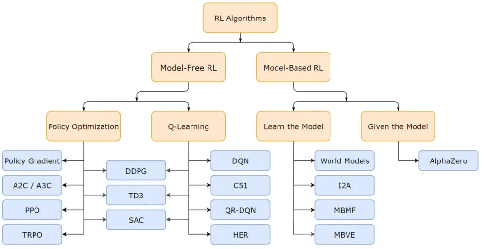

# Reinforcement Learning Guide:

## Part I: General Concepts
1. Agent: Model that you can control

2. Environment: A space that you couldn't directly control, but can interact through agent

| Flow | Description |
|:---|:---|
| Agent → Environment (Action) | Agent manipulate/interact environment |
| Environment → Agent (State) | Environment give a result after an agent made an action |

3. Action (a): What the agent do/interact with the environment (i.e. Motor Speed, Direction)

4. State (s): The factors surrounding the environment (i.e. velocity, position, temperature)

5. Reward (r): A value after each action to determine if the action is good/bad. Set by the user when customizing RL training script based on their requirements
   - $r_t = R(s_t, a_t, s_{t+1}, a_{t+1})$

6. Return ($\tau$):
   - **Finite-Horizon undiscounted return:** Sum of rewards obtained in a fixed windows of state\
     R($\tau$) = $\Sigma_{t=0}^{T}r_t$, 
     Where:
     - T = total windows size
     - t = single episode
   - **Infinite-Horizon undiscounted return:** Sum of rewards ever obtained by the model, currently and in the future\
     R($\tau$) = $\Sigma_{t=0}^{\infty}\gamma^t r_t$ 
     Where: 
     - t = single episode 
     - r = reward with t(timestamp)
     - $\gamma$ = Constant for EMA, used to determine how important future rewards will be (range: 0 - 1)
     
   Goal: 
   Calculate the total rewards based on the actions done by the model currently and in the future 
   During training, it will collect the sequence of the model's action, then put into a time index. It will then loop through the time index, and sum up the rewards through index.

   **How is return calculated:**
     - In return function, it goes through the index from 1 to T across the entire rollout, and based on the current index, the index after it is flagged as future reward while the ones before is flagged as past reward.
     - i.e.: If the rollout is 100 steps, at 10th step in the rollout, step 1-9 is considered past reward, while step 11-100 is considered future reward.
     - It doesn't necessarily predict or estimate future movements, but rather let the agent run finish 1 full rollout, then compute the return value
     - i.e.: R($\tau$) = $\Sigma_{t=0}^{99}r_t$ = $`\underbrace{r_0 + r_1 + r_2 + ... + r_8}_{\text{past rewards}} + \underbrace{r_9}_{\text{current reward}} + \underbrace{r_{10} + r_{11} + r_{12} + ... + r_{99}}_{\text{future reward}}`$
   
7. Policy: Given a state, it decides the best action that'll maximize the reward (Similar to how forward propagation works in deep learning)
   ## Preface
   **How does policy function**:
   - In Reinforcement Learning, we usually use a neural network to act as the learnable weights. This act as the brain of our agents where its able to learn the relationship between the states and the actions, which provides the most optimal output.
   - For example, if we use a 2 layer neural network, it will receive the input of the state vectors, then pass it to the larger hidden layers where it's able to learn the hidden relationship between the states and the actions, then output an action as the final output.
   - The size of the output is determined based on the policy type, which is differentiated into deterministic policy and stochastic policy:
    
    7a) Deterministic Policy $a = \mu(s)$: 
    - Refers to a policy where the agent will always perform this same action given a specific state. 
      - For example, if the agent is placed in state A, it will directly perform action P.
      - Commonly used when the state produce the same action 
      - Exp Algo: DDPG algorithm
    
    7b) Stochastic Policy $a \sim \pi(.|s) // \pi_\theta(a|s) // \pi(a|s; \theta)$: 
    - Map a state to a probability distribution of actions, where the agent is given a list of possibilities on which actions it should make given a specific state. 
      - For example, if the agent is placed in state A, it will have a 70% chance of performing action P, 20% chance of performing action Q, 10% chance of performing action R.
      - Commonly used for complex environment & exploring different possibilities of actions
      - Exp Algo: PPO, Q-Learning
    
      Follow up on 7b):
      i) Epsilon-Greedy (ε-greedy): A simple/brute-force way for exploration
      - Pick a number for ε between 0 - 1
      - We put the probability of actions to be taken by the agent as 1 - ε. If the ε value is high (~0.7 - 0.8), the probability will be very low, which encourage the agent to explore with random actions. If the ε value is low (~0.1 - 0.2), the probability will be very high, which encourage the agent to be more conservative and most likely to choose the best action
      - The goal: Choose the probability to be 1 - ε, in the beginning choose ε to be a high value (~0.7-0.8) for early exploration, then decay ε to be low value to narrow down the best action to choose.
           
      ii) Entropy: Measure how spread out the actions probability are
        - If the model entropy is high [0.25, 0.25, 0.25, 0.25], it's unsure of which actions to take and will take random actions (low weight focus)
        - If the model entropy is low [0.95, 0.01, 0.02, 0.02], it is confident of which actions to take and perform the actions (high weight focus)
        - 
        
      iii) Log-Likelihood: Use in stochastic policy to maximize the "good" actions probability and minimize the "bad" actions probability 
        - The purpose is that probability values are small, which leads to gradient vanishing. Thus, by passing the proba into log, it will scale up the values of the proba which ensures numerical stability
        - In Stochastic Policy algorithms like PPO, it uses the gradient of log functions during update, where by updating the params, Θ, it will increase the log-likelihood of the actions taken, and vice versa.
    
    Example of Policy Network in Hexapod Locomotion Reinforcement Learning:
    

    

## Part 2: Taxonomy of Reinforcement Learning


=======================================================================================\
Reinforcement Learning\
=======================================================================================\
i. Model Free RL
- Learn from experience, directly learn which action should be done in the specific state to maximize the rewards
- Does not understand how the environment works, only know which action gives the best reward in the state given
- **Exp Algo:** Q-Learning, Policy Optimization

    a) On Policy Based: 
    - In On Policy, the agent only learns from the policy that it currently uses, and discard old policies experience.
    - Whenever the agent make an action, it evaluates the action and/or state and update the policy accordingly.
    - Once the policy has been updated, the old policy is discarded while the new one is being used
    - Thus, it learns from the latest experience
    - **Advantage:** It is more stable and converge faster as the data used is fresh which reflects the current state of the agent, and improve its strategy
    - **Disadvantage:** It is inefficient as old policy are discarded every update, which makes it unable to reuse past experiences
    - **Exp Algo:** Proximal Policy Optimization (PPO), Asynchronous Advantage Actor-Critic (A3C)

    b) Off Policy Based: 
    - In Off Policy, the agent uses 2 policies, which are behavioral & target policy
    - Behavioral Policy: Used for exploring by moving randomly
    - Target Policy: Uses behavioral policy data to calculate the best action given a state
    - Thus, it learns from combination of latest and past experiences
    - **Advantage:** It is efficient since it can reuse past data in old policies (behavioral policy)
    - **Disadvantage:** It can be unstable and converges slower as the old data might pollute the agent in making decisions
    - **Exp Algo:** Q-Learning, Deep-Q-Network    

    c) Policy Based: $\pi(a|s; \theta)$
    - Refers to algorithm that trains the agent without a value function, V(s) or a Q Function, Q(a, s)
    - Policy parameterized by theta(weights), $\pi(a|s; \theta)$: The aim of the agent is to change the value of $\theta$ to maximize the expected return
    - In short, Policy Based RL directly improves the policy by tweaking the weights without needing an extra function
    - **Exp Algo:** Proximal Policy Optimization (PPO), Trust Region Policy Optimization (TRPO)

    d) Value Based: $V(s)$
    - In Value Based RL, it refers to algorithms that trains the agent with a value function
    - Value Function, V(s): Used to evaluate how "good" is the current state that the agent in. If it is good, it returns rewards, and vice versa
    ### Follow up on Value Based RL
    - Q Function, Q(a, s): Used to evaluate how "good" the specific agent's action is given a state. If the action is good, it returns rewards, and vice versa
    - **Difference between V(s) and Q(a, s)**: Value Function evaluate if the agent's state is good, while Q Function evaluate if the agent's action is good given a state
    - **Exp Algo:** Q-Learning, Deep-Q-Network, Monte Carlo Method
    
    e) Actor-Critic Function (Hybrid Method)
    - In Actor-Critic RL, it combines both Policy Based (Actor) and Value Based (Critic) functions
    - The goal is to reduce variance in Policy Based RL, while enabling higher flexibility in Value Based RL
    - **Policy Based (Actor)**: It learns through a policy, $\pi(a, s|\theta)$ which distributes a set of actions given a state. It then adjusts the $\theta$ value to maximize expected return, $\mathbb{E}(\tau)$
    - **Value Based (Critic)**: It defines a **Value Function** or **Q Function** to determine if the "state" or "action" of a model is good
    - **Advantage Function**: $A(s, a) = Q(s, a) - V(s)$. It is used to estimate how good a model's action is in a given state compared to the expected reward
    - **Temporal Difference**: $\delta_t = r_{t+1} + \gamma V(s_{t+1}) - V(s_t)$. It is used to calculate the difference between the current reward plus the immediate next reward and the current Value Function
    - **Exp Algo:** Soft Actor Critic (SAC), Asynchronous Advantage Actor-Critic (A3C), PPO

ii. Model-Based RL
- Learns how the environment works, and plan actions to simulate the future
- **Exp Algo:** Alpha Zero

=======================================================================================\
Advanced Value-Based Methods
=======================================================================================\
a) General Value Functions:\
$`\underbrace{V_\pi (s)}_{\text{Value Function} } = \underbrace{\mathbb{E}_\pi[R_{t+1} + \gamma R_{t+2} + \gamma^2 R_{t+3} + ...}_{Expected Discounted Return} | \underbrace{S_t = s}_{Current State in the sequence of states}]`$

b) On-Policy Value Function:\
$`V^\pi(s) = \underbrace{\mathbb{E}}_{\tau \sim \pi}[R(\tau)|s_0 = s, a_0 = a]`$\
In On-Policy Value Function, it calculates the expected return given a state and the agent acts according with the policy function $\pi$

c) On-Policy Action-Value Function:\
$`Q^\pi(s, a) = \underbrace{\mathbb{E}}_{\tau \sim \pi}[R(\tau)|s_0 = s, a_0 = a]`$\
In On-Policy Action-Value Function, it calculates the expected return if the agent start in a state, takes an initial action, and then act and update according to policy $\pi$

10. Optimal Value Function: In Optimal Value Function, it maximizes the expected return if the agent start in a state, and acts according the optimal policy. Optimal policy here refer to the converged neural network.
```math
V^*(s) = \underbrace{max}_{\pi}V^\pi(s)
```

11. Optimal Action-Value Function: In Optimal Value Function, it maximizes the expected return if the agent start in a state, takes an initial action, and acts according the optimal policy
```math
Q^*(s, a) = \underbrace{max}_{\pi}Q^\pi(s, a)
```

10. Episode: A complete series of actions done by a model with the state from start to finish
11. Rollout: A set series of actions done by a model with the state (subset of episode). Used to update policy.
12. Epochs: Used to collect the full rollout/episode data (actions), pass it to the neural network, and perform backpropagation to converge
13. Iteration: A full cycle of running full rollout, aimed to gather latest fresh data based on action of agent with the environment. 

Example (4096 env of playing 10 chess game):

```text
Iteration (Game 0 - 9) <------------------------------
    |                                                |
    V                                                |
 Episode (Game Win/Lose)                             |
    |                                                |
    V                                                |
 Rollout (Every 10 moves in a game)                  |
    |                                                |
    V                                                |
 Epochs (Take actions from rollout, run 6 times) ----|
```

14. Trajectory, ($\tau$): Sequence of state and actions in the environment. $\tau = (s_0, a_0, s_1, a_1, ...)$

6. Markov Decision Process: 
s -> a -> r -> s -> a -> r
Goal: Given a state, what will be the reward if the action is taken by the agent/model

